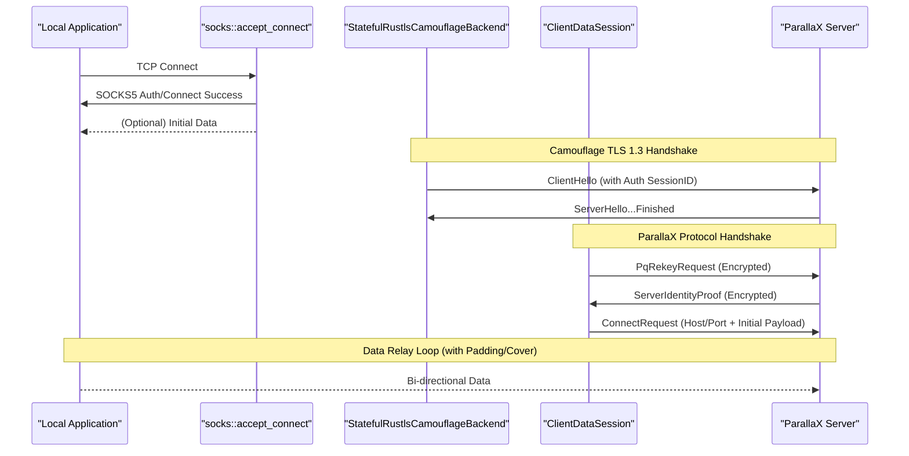

# Client Runtime & SOCKS5 Proxy
Relevant source files

- [src/client/mod.rs](https://github.com/yuzeguitarist/ParallaX/blob/77045cea/src/client/mod.rs)
- [src/client/runtime.rs](https://github.com/yuzeguitarist/ParallaX/blob/77045cea/src/client/runtime.rs)
- [src/client/socks.rs](https://github.com/yuzeguitarist/ParallaX/blob/77045cea/src/client/socks.rs)
- [src/handshake/client.rs](https://github.com/yuzeguitarist/ParallaX/blob/77045cea/src/handshake/client.rs)

The ParallaX client acts as a local SOCKS5 proxy that transparently tunnels application traffic through a camouflage TLS 1.3 connection. The runtime is responsible for intercepting local requests, performing a multi-stage cryptographic handshake with the ParallaX server, and maintaining a duplex relay loop that incorporates cover traffic and padding to resist traffic analysis.

## Runtime Lifecycle

The client entry point is the `run` function in `src/client/runtime.rs`. It initializes the environment by decoding cryptographic keys (PSK, X25519, ML-KEM, and ML-DSA) and starts a `TcpListener` on the configured SOCKS5 port.

### Execution Flow

1. Initialization: Decodes the Pre-Shared Key (PSK) and the server's public keys from the configuration [src/client/runtime.rs#66-79](https://github.com/yuzeguitarist/ParallaX/blob/77045cea/src/client/runtime.rs#L66-L79)
2. Accept Loop: Listens for incoming TCP connections. Each connection is handled in a separate `tokio` task via `handle_local_connection`[src/client/runtime.rs#83-105](https://github.com/yuzeguitarist/ParallaX/blob/77045cea/src/client/runtime.rs#L83-L105)
3. SOCKS5 Negotiation: Performs the SOCKS5 "No Authentication" handshake with the local application [src/client/socks.rs#41-49](https://github.com/yuzeguitarist/ParallaX/blob/77045cea/src/client/socks.rs#L41-L49)
4. Initial Payload Capture: Attempts to read a small "initial payload" from the local stream (up to 2ms timeout) to bundle it with the connection request, reducing round-trips [src/client/runtime.rs#158-176](https://github.com/yuzeguitarist/ParallaX/blob/77045cea/src/client/runtime.rs#L158-L176)
5. Camouflage Handshake: Establishes a TLS 1.3 connection to the ParallaX server that mimics a legitimate browser [src/client/runtime.rs#178-196](https://github.com/yuzeguitarist/ParallaX/blob/77045cea/src/client/runtime.rs#L178-L196)
6. Data Session Establishment: Derives session keys and performs post-quantum rekeying and server identity verification [src/client/runtime.rs#124-142](https://github.com/yuzeguitarist/ParallaX/blob/77045cea/src/client/runtime.rs#L124-L142)
7. Relay Loop: Enters a bi-directional relay state with cover traffic injection [src/client/runtime.rs#146-156](https://github.com/yuzeguitarist/ParallaX/blob/77045cea/src/client/runtime.rs#L146-L156)

### Client Connection Handling Logic

The following diagram illustrates the sequence of operations within `handle_local_connection`.

"Client Connection Sequence"

Sources: [src/client/runtime.rs#108-156](https://github.com/yuzeguitarist/ParallaX/blob/77045cea/src/client/runtime.rs#L108-L156)[src/client/socks.rs#41-49](https://github.com/yuzeguitarist/ParallaX/blob/77045cea/src/client/socks.rs#L41-L49)[src/handshake/client.rs#81-152](https://github.com/yuzeguitarist/ParallaX/blob/77045cea/src/handshake/client.rs#L81-L152)

## SOCKS5 Proxy Implementation

The `src/client/socks.rs` module implements a minimal SOCKS5 server [src/client/socks.rs#41-49](https://github.com/yuzeguitarist/ParallaX/blob/77045cea/src/client/socks.rs#L41-L49) It specifically supports the `CONNECT` command [src/client/socks.rs#85-88](https://github.com/yuzeguitarist/ParallaX/blob/77045cea/src/client/socks.rs#L85-L88) and handles three address types:

- IPv4: Decoded as a `u32`[src/client/socks.rs#93-96](https://github.com/yuzeguitarist/ParallaX/blob/77045cea/src/client/socks.rs#L93-L96)
- Domain Name: Decoded as a length-prefixed string [src/client/socks.rs#97-105](https://github.com/yuzeguitarist/ParallaX/blob/77045cea/src/client/socks.rs#L97-L105)
- IPv6: Decoded as a `u128`[src/client/socks.rs#106-109](https://github.com/yuzeguitarist/ParallaX/blob/77045cea/src/client/socks.rs#L106-L109)

Once the SOCKS5 handshake is successful, the target `host` and `port` are encapsulated into a `SocksRequest` struct [src/client/socks.rs#7-10](https://github.com/yuzeguitarist/ParallaX/blob/77045cea/src/client/socks.rs#L7-L10) which is later used to build the ParallaX `ConnectRequest`[src/client/runtime.rs#134-142](https://github.com/yuzeguitarist/ParallaX/blob/77045cea/src/client/runtime.rs#L134-L142)

## Data Session & Handshake

The `ClientDataSession` manages the state of an active connection, including the AEAD codecs for encryption/decryption and the session keys [src/handshake/client.rs#75-79](https://github.com/yuzeguitarist/ParallaX/blob/77045cea/src/handshake/client.rs#L75-L79)

### Key Functions

- `establish_data_session`: Uses the `StatefulRustlsCamouflageBackend` to complete the TLS handshake and then calls `derive_session_keys` to generate the initial ParallaX session keys from the TLS transcript and X25519 shared secret [src/client/runtime.rs#178-196](https://github.com/yuzeguitarist/ParallaX/blob/77045cea/src/client/runtime.rs#L178-L196)
- `build_pq_rekey_record`: Generates an ML-KEM encapsulation, wraps it in a `PqRekeyRequest`, and updates the session keys using a "hybrid sandwich" construction [src/handshake/client.rs#91-107](https://github.com/yuzeguitarist/ParallaX/blob/77045cea/src/handshake/client.rs#L91-L107)
- `verify_server_identity_record`: Decrypts the server's identity proof and verifies the ML-DSA signature against the transcript hash and server public keys [src/handshake/client.rs#136-152](https://github.com/yuzeguitarist/ParallaX/blob/77045cea/src/handshake/client.rs#L136-L152)

### Session State Transitions

"ClientDataSession State & Entities"

[Class Diagram]

Sources: [src/client/runtime.rs#108-156](https://github.com/yuzeguitarist/ParallaX/blob/77045cea/src/client/runtime.rs#L108-L156)[src/handshake/client.rs#75-89](https://github.com/yuzeguitarist/ParallaX/blob/77045cea/src/handshake/client.rs#L75-L89)[src/protocol/data.rs#16-17](https://github.com/yuzeguitarist/ParallaX/blob/77045cea/src/protocol/data.rs#L16-L17)

## The Relay Loop & Cover Traffic

The `relay` function is the core of the data transfer phase [src/client/runtime.rs#198-210](https://github.com/yuzeguitarist/ParallaX/blob/77045cea/src/client/runtime.rs#L198-L210) It uses `tokio::select!` to multiplex between four asynchronous events:

1. Local Read: Reads data from the local application. If data is available, it is sealed into a `DataRecord` (applying padding) and written to the server [src/client/runtime.rs#219-224](https://github.com/yuzeguitarist/ParallaX/blob/77045cea/src/client/runtime.rs#L219-L224)
2. Server Read: Reads encrypted records from the server. It decrypts them, removes padding, and writes the plaintext to the local application [src/client/runtime.rs#228-235](https://github.com/yuzeguitarist/ParallaX/blob/77045cea/src/client/runtime.rs#L228-L235)
3. Cover Traffic Timer: If `CoverTrafficProfile` is enabled, a timer triggers at random intervals. When it fires, the client sends an empty "dummy" record to the server to mask traffic patterns [src/client/runtime.rs#214-217](https://github.com/yuzeguitarist/ParallaX/blob/77045cea/src/client/runtime.rs#L214-L217)
4. Internal State: Tracks if server data has started to ensure the local application only receives data after the SOCKS5 handshake is fully acknowledged by the remote relay [src/client/runtime.rs#208](https://github.com/yuzeguitarist/ParallaX/blob/77045cea/src/client/runtime.rs#L208-L208)

### Traffic Shaping Integration

Every packet sent through `seal_payload` is processed by the `PaddingProfile`, which adds random or distribution-based padding to the plaintext before AEAD encryption [src/handshake/client.rs#121-130](https://github.com/yuzeguitarist/ParallaX/blob/77045cea/src/handshake/client.rs#L121-L130) This ensures that even small control messages or variable-length application data result in standardized packet sizes on the wire.

Sources: [src/client/runtime.rs#198-240](https://github.com/yuzeguitarist/ParallaX/blob/77045cea/src/client/runtime.rs#L198-L240)[src/handshake/client.rs#121-130](https://github.com/yuzeguitarist/ParallaX/blob/77045cea/src/handshake/client.rs#L121-L130)[src/traffic/mod.rs#32](https://github.com/yuzeguitarist/ParallaX/blob/77045cea/src/traffic/mod.rs#L32-L32)