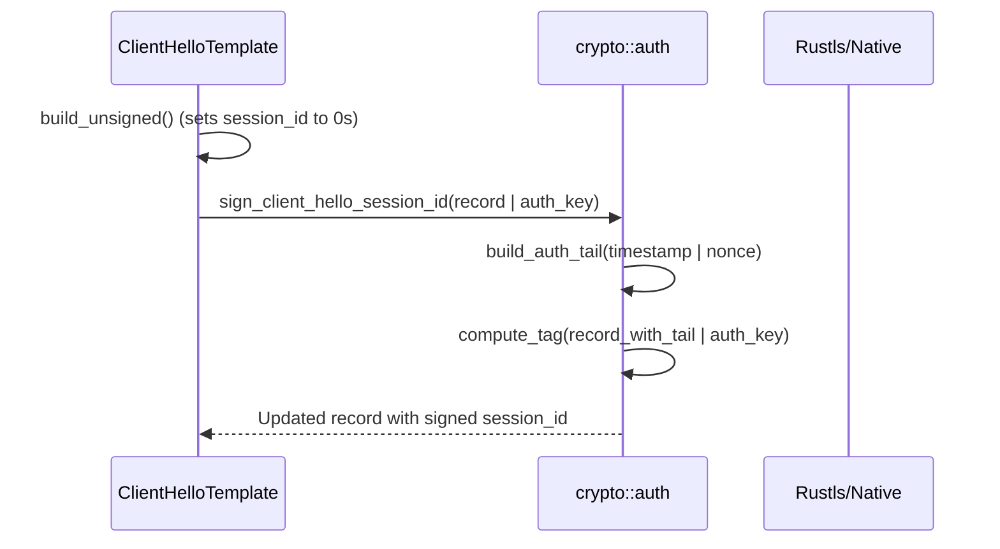

# ClientHello Authentication (PSK + X25519)
Relevant source files

- [src/crypto/auth.rs](https://github.com/yuzeguitarist/ParallaX/blob/77045cea/src/crypto/auth.rs)
- [src/handshake/mod.rs](https://github.com/yuzeguitarist/ParallaX/blob/77045cea/src/handshake/mod.rs)
- [src/tls/client_hello.rs](https://github.com/yuzeguitarist/ParallaX/blob/77045cea/src/tls/client_hello.rs)
- [src/tls/client_hello_builder.rs](https://github.com/yuzeguitarist/ParallaX/blob/77045cea/src/tls/client_hello_builder.rs)

ParallaX implements a stealthy authentication mechanism that embeds cryptographic proofs directly into the standard TLS 1.3 `ClientHello` message. By hijacking the `session_id` field, ParallaX allows a server to distinguish between legitimate authorized clients and active probes without deviating from valid TLS syntax. This layer combines a Pre-Shared Key (PSK) with an X25519 Diffie-Hellman exchange to derive unique, per-session authentication keys.

## Authentication Mechanism Overview

The authentication process occurs during the initial TCP/TLS handshake. The client constructs a standard-compliant `ClientHello` but modifies the `session_id` field to carry a 32-byte ParallaX authentication payload.

### Session ID Layout

The 32-byte `session_id` is structured as follows:

| Offset | Length | Field | Description |
| --- | --- | --- | --- |
| 0 | 16 bytes | `AuthTag` | HMAC-SHA256 truncated tag protecting the transcript or SNI. |
| 16 | 8 bytes | `Timestamp` | Big-endian Unix timestamp (seconds) for freshness. |
| 24 | 8 bytes | `Nonce` | Random bytes to ensure unique session IDs even within the same second. |

Sources: `<FileRef file-url="https://github.com/yuzeguitarist/ParallaX/blob/77045cea/src/crypto/auth.rs#L15-L19" min=15 max=19 file-path="src/crypto/auth.rs">Hii</FileRef>`, `<FileRef file-url="https://github.com/yuzeguitarist/ParallaX/blob/77045cea/src/crypto/auth.rs#L113-L117" min=113 max=117 file-path="src/crypto/auth.rs">Hii</FileRef>`

## Key Derivation (HKDF)

ParallaX uses a hybrid approach for authentication keys. It combines a static PSK with an ephemeral X25519 key share to prevent impersonation even if the PSK is leaked (assuming the attacker does not have the private key corresponding to the public key used in the exchange).

### Derivation Logic

The authentication key is derived using HKDF-SHA256:

1. Shared Secret: An X25519 Diffie-Hellman exchange is performed using the local private key and the peer's public key.
2. HKDF Extract: The `salt` is the PSK, and the `ikm` (Input Keying Material) is the X25519 shared secret.
3. HKDF Expand: The info string is `b"ParallaX v1 ClientHello authentication"`.

[Flowchart Diagram]

Sources: `<FileRef file-url="https://github.com/yuzeguitarist/ParallaX/blob/77045cea/src/crypto/auth.rs#L182-L215" min=182 max=215 file-path="src/crypto/auth.rs">Hii</FileRef>`

## Client-Side: Signing the ClientHello

The client generates the authentication payload and injects it into the `ClientHello` before transmission.

1. Key Share Generation: The client generates an ephemeral X25519 key pair. The public key is placed in the `ClientHello.random` field `<FileRef file-url="https://github.com/yuzeguitarist/ParallaX/blob/77045cea/src/tls/client_hello_builder.rs#L80-L81" min=80 max=81 file-path="src/tls/client_hello_builder.rs">Hii</FileRef>`.
2. Unsigned Template: A `ClientHello` is built with a 32-byte zeroed `session_id``<FileRef file-url="https://github.com/yuzeguitarist/ParallaX/blob/77045cea/src/tls/client_hello_builder.rs#L82-L83" min=82 max=83 file-path="src/tls/client_hello_builder.rs">Hii</FileRef>`.
3. Tail Construction: A tail containing the current timestamp and a random nonce is appended to the `session_id` range `<FileRef file-url="https://github.com/yuzeguitarist/ParallaX/blob/77045cea/src/crypto/auth.rs#L79-L81" min=79 max=81 file-path="src/crypto/auth.rs">Hii</FileRef>`.
4. Tag Computation: `compute_tag` calculates an HMAC-SHA256 over the entire `ClientHello` record (with the tag portion zeroed) using the derived `auth_key``<FileRef file-url="https://github.com/yuzeguitarist/ParallaX/blob/77045cea/src/crypto/auth.rs#L83-L84" min=83 max=84 file-path="src/crypto/auth.rs">Hii</FileRef>`.

### Data Flow: ClientHello Signing

Sources: `<FileRef file-url="https://github.com/yuzeguitarist/ParallaX/blob/77045cea/src/tls/client_hello_builder.rs#L53-L64" min=53 max=64 file-path="src/tls/client_hello_builder.rs">Hii</FileRef>`, `<FileRef file-url="https://github.com/yuzeguitarist/ParallaX/blob/77045cea/src/crypto/auth.rs#L45-L86" min=45 max=86 file-path="src/crypto/auth.rs">Hii</FileRef>`

## Server-Side: Verification

The server intercepts the inbound `ClientHello` and attempts to verify the authentication tag. If verification fails, the server treats the connection as a standard probe and typically redirects it to a fallback backend.

### Verification Logic (`verify_client_hello_auth`)

The server performs two types of verification to ensure robustness:

1. Transcript Authentication: Recomputes the HMAC over the entire received `ClientHello` record and compares it to the `AuthTag` in the `session_id``<FileRef file-url="https://github.com/yuzeguitarist/ParallaX/blob/77045cea/src/crypto/auth.rs#L137-L143" min=137 max=143 file-path="src/crypto/auth.rs">Hii</FileRef>`.
2. Stateful Authentication: Specifically verifies a tag computed over the SNI and the X25519 key share found in `ClientHello.random`. This serves as a backup check `<FileRef file-url="https://github.com/yuzeguitarist/ParallaX/blob/77045cea/src/crypto/auth.rs#L144-L154" min=144 max=154 file-path="src/crypto/auth.rs">Hii</FileRef>`.

The server also extracts the `timestamp` and `nonce` for use in the `ReplayCache` to prevent replay attacks `<FileRef file-url="https://github.com/yuzeguitarist/ParallaX/blob/77045cea/src/crypto/auth.rs#L155-L172" min=155 max=172 file-path="src/crypto/auth.rs">Hii</FileRef>`.

### Entity Relationship: Authentication Logic

[Class Diagram]

Sources: `<FileRef file-url="https://github.com/yuzeguitarist/ParallaX/blob/77045cea/src/tls/client_hello.rs#L15-L22" min=15 max=22 file-path="src/tls/client_hello.rs">Hii</FileRef>`, `<FileRef file-url="https://github.com/yuzeguitarist/ParallaX/blob/77045cea/src/crypto/auth.rs#L21-L29" min=21 max=29 file-path="src/crypto/auth.rs">Hii</FileRef>`, `<FileRef file-url="https://github.com/yuzeguitarist/ParallaX/blob/77045cea/src/crypto/auth.rs#L119-L173" min=119 max=173 file-path="src/crypto/auth.rs">Hii</FileRef>`

## Key Functions and Constants

| Entity | Location | Description |
| --- | --- | --- |
| `SESSION_ID_LEN` | `<FileRef file-url="https://github.com/yuzeguitarist/ParallaX/blob/77045cea/src/crypto/auth.rs#L15-L15" min=15 file-path="src/crypto/auth.rs">Hii</FileRef>` | Fixed at 32 bytes to match standard TLS session ID length. |
| `derive_client_auth_key` | `<FileRef file-url="https://github.com/yuzeguitarist/ParallaX/blob/77045cea/src/crypto/auth.rs#L182-L188" min=182 max=188 file-path="src/crypto/auth.rs">Hii</FileRef>` | Client-side entry point for HKDF key derivation. |
| `derive_server_auth_key` | `<FileRef file-url="https://github.com/yuzeguitarist/ParallaX/blob/77045cea/src/crypto/auth.rs#L190-L196" min=190 max=196 file-path="src/crypto/auth.rs">Hii</FileRef>` | Server-side entry point for HKDF key derivation. |
| `sign_client_hello_session_id` | `<FileRef file-url="https://github.com/yuzeguitarist/ParallaX/blob/77045cea/src/crypto/auth.rs#L45-L58" min=45 max=58 file-path="src/crypto/auth.rs">Hii</FileRef>` | In-place modification of a `ClientHello` buffer to add authentication. |
| `verify_client_hello_auth` | `<FileRef file-url="https://github.com/yuzeguitarist/ParallaX/blob/77045cea/src/crypto/auth.rs#L119-L173" min=119 max=173 file-path="src/crypto/auth.rs">Hii</FileRef>` | Validates a `ClientHello` record and extracts metadata. |
| `compute_tag` | `<FileRef file-url="https://github.com/yuzeguitarist/ParallaX/blob/77045cea/src/crypto/auth.rs#L217-L223" min=217 max=223 file-path="src/crypto/auth.rs">Hii</FileRef>` | Core HMAC-SHA256 calculation over the TLS record. |

Sources: `<FileRef file-url="https://github.com/yuzeguitarist/ParallaX/blob/77045cea/src/crypto/auth.rs#L1-L223" min=1 max=223 file-path="src/crypto/auth.rs">Hii</FileRef>`