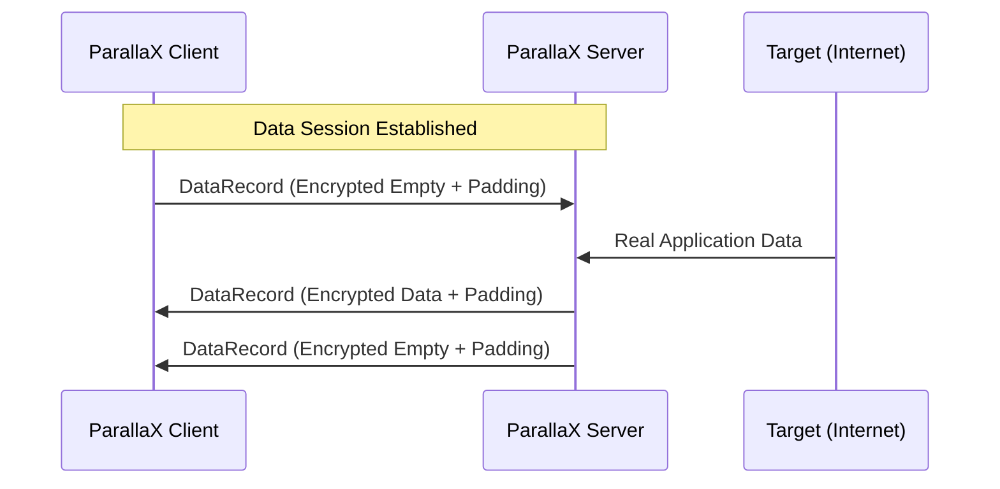

# Cover Traffic
Relevant source files

- [src/client/runtime.rs](https://github.com/yuzeguitarist/ParallaX/blob/77045cea/src/client/runtime.rs)
- [src/handshake/server.rs](https://github.com/yuzeguitarist/ParallaX/blob/77045cea/src/handshake/server.rs)
- [src/traffic.rs](https://github.com/yuzeguitarist/ParallaX/blob/77045cea/src/traffic.rs)

The Cover Traffic system in ParallaX is designed to defeat traffic analysis by maintaining a baseline packet frequency even when no application data is being transmitted. By injecting dummy packets at randomized intervals, ParallaX masks the start, end, and volume of actual user activity, making it difficult for observers to distinguish between an idle connection and active browsing.

## Cover Traffic Profile

The `CoverTrafficProfile` struct manages the timing logic for dummy packet generation. It is initialized from the global `TrafficConfig` and provides methods to determine if cover traffic is active and to calculate the next firing interval.

### Configuration Fields

The behavior is governed by two primary configuration keys in `parallax.toml`:

- `cover_min_interval_ms`: The minimum delay between dummy packets.
- `cover_max_interval_ms`: The maximum delay between dummy packets. Setting this to `0` disables cover traffic [src/traffic.rs#147-149](https://github.com/yuzeguitarist/ParallaX/blob/77045cea/src/traffic.rs#L147-L149)

### Key Functions

- `is_enabled()`: Returns `true` if `cover_max_interval_ms` is greater than zero [src/traffic.rs#147-149](https://github.com/yuzeguitarist/ParallaX/blob/77045cea/src/traffic.rs#L147-L149)
- `sample_interval<R>()`: Generates a `Duration` for the next dummy packet by sampling a uniform distribution between the configured min and max bounds [src/traffic.rs#151-163](https://github.com/yuzeguitarist/ParallaX/blob/77045cea/src/traffic.rs#L151-L163)

Sources:[src/traffic.rs#30-34](https://github.com/yuzeguitarist/ParallaX/blob/77045cea/src/traffic.rs#L30-L34)[src/traffic.rs#139-163](https://github.com/yuzeguitarist/ParallaX/blob/77045cea/src/traffic.rs#L139-L163)[src/config.rs#19-22](https://github.com/yuzeguitarist/ParallaX/blob/77045cea/src/config.rs#L19-L22)

---

## Implementation in Client Runtime

The client-side implementation occurs within the `relay` function. After the TLS camouflage handshake is complete, the client enters a `tokio::select!` loop that multiplexes between local data, server data, and the cover traffic timer.

### Client Relay Flow

1. Timer Initialization: A `cover_sleep` future is pinned using an initial interval sampled from the `CoverTrafficProfile`[src/client/runtime.rs#209-211](https://github.com/yuzeguitarist/ParallaX/blob/77045cea/src/client/runtime.rs#L209-L211)
2. Firing Logic: When the `cover_sleep` timer expires, the client checks `cover.is_enabled()`. If true, it generates a dummy record [src/client/runtime.rs#213-214](https://github.com/yuzeguitarist/ParallaX/blob/77045cea/src/client/runtime.rs#L213-L214)
3. Dummy Generation: The client calls `data_session.seal_payload(&[], &mut rng)`. Passing an empty slice results in a `DataRecord` containing only padding [src/client/runtime.rs#215](https://github.com/yuzeguitarist/ParallaX/blob/77045cea/src/client/runtime.rs#L215-L215)
4. Timer Reset: After the dummy packet is sent, the timer is reset with a new randomized interval [src/client/runtime.rs#217](https://github.com/yuzeguitarist/ParallaX/blob/77045cea/src/client/runtime.rs#L217-L217)

### Code-to-System Mapping: Client Relay

Title: Client Cover Traffic Logic

[Flowchart Diagram]

Sources:[src/client/runtime.rs#198-218](https://github.com/yuzeguitarist/ParallaX/blob/77045cea/src/client/runtime.rs#L198-L218)[src/traffic.rs#151-163](https://github.com/yuzeguitarist/ParallaX/blob/77045cea/src/traffic.rs#L151-L163)

---

## Implementation in Server DataRelay

On the server side, cover traffic is handled within the `DataRelay` structure. Similar to the client, the server must generate dummy packets to mask the downstream traffic pattern (Server to Client).

### DataRelay Integration

The server's `relay` loop in `DataRelay` utilizes a `tokio::select!` block to manage the bidirectional flow.

- Upstream (Client to Server): When a record is received, the server calls `codec.open()`. If the resulting plaintext is empty, it is identified as a dummy packet and discarded, preventing it from being forwarded to the actual destination (e.g., a website) [src/handshake/server.rs#645-655](https://github.com/yuzeguitarist/ParallaX/blob/77045cea/src/handshake/server.rs#L645-L655)
- Downstream (Server to Client): If the `cover_sleep` timer expires, the server generates an empty record using `codec.seal(&[], ...)` and sends it to the client [src/handshake/server.rs#675-685](https://github.com/yuzeguitarist/ParallaX/blob/77045cea/src/handshake/server.rs#L675-L685)

### Code-to-System Mapping: Server Relay

Title: Server DataRelay Handling

[Flowchart Diagram]

Sources:[src/handshake/server.rs#625-690](https://github.com/yuzeguitarist/ParallaX/blob/77045cea/src/handshake/server.rs#L625-L690)[src/protocol/data.rs#38-42](https://github.com/yuzeguitarist/ParallaX/blob/77045cea/src/protocol/data.rs#L38-L42)

---

## Traffic Interaction Summary

The following table summarizes how cover traffic interacts with the underlying protocol layers:

| Layer | Component | Action on Cover Traffic |
| --- | --- | --- |
| Traffic | `CoverTrafficProfile` | Calculates randomized `Duration` based on config [src/traffic.rs#151-163](https://github.com/yuzeguitarist/ParallaX/blob/77045cea/src/traffic.rs#L151-L163) |
| Crypto | `AeadCodec` | Encrypts the empty payload with a unique nonce and increments the epoch sequence [src/crypto/session.rs#210-225](https://github.com/yuzeguitarist/ParallaX/blob/77045cea/src/crypto/session.rs#L210-L225) |
| Protocol | `DataRecordCodec` | Adds `PaddingProfile` noise to the empty payload, making dummy packets indistinguishable in size from small data packets [src/protocol/data.rs#105-115](https://github.com/yuzeguitarist/ParallaX/blob/77045cea/src/protocol/data.rs#L105-L115) |
| Runtime | `relay` loop | Discards decrypted payloads with `length == 0` to prevent dummy data from reaching the application [src/client/runtime.rs#240-250](https://github.com/yuzeguitarist/ParallaX/blob/77045cea/src/client/runtime.rs#L240-L250) |

### Sequence Diagram: Dummy Packet Exchange

Title: Cover Traffic Sequence

Sources:[src/client/runtime.rs#213-218](https://github.com/yuzeguitarist/ParallaX/blob/77045cea/src/client/runtime.rs#L213-L218)[src/handshake/server.rs#645-655](https://github.com/yuzeguitarist/ParallaX/blob/77045cea/src/handshake/server.rs#L645-L655)[src/handshake/server.rs#675-685](https://github.com/yuzeguitarist/ParallaX/blob/77045cea/src/handshake/server.rs#L675-L685)