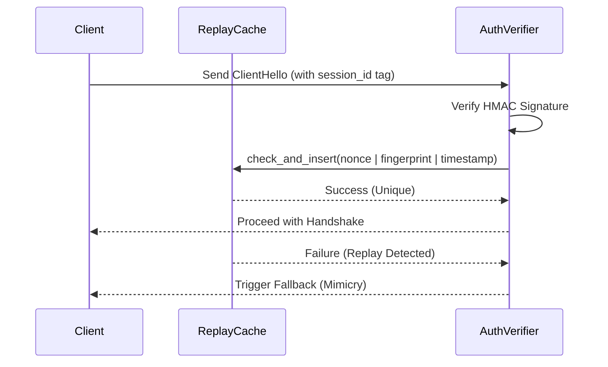

# Cryptographic Subsystems
Relevant source files

- [src/crypto/auth.rs](https://github.com/yuzeguitarist/ParallaX/blob/77045cea/src/crypto/auth.rs)
- [src/crypto/identity.rs](https://github.com/yuzeguitarist/ParallaX/blob/77045cea/src/crypto/identity.rs)
- [src/crypto/mod.rs](https://github.com/yuzeguitarist/ParallaX/blob/77045cea/src/crypto/mod.rs)
- [src/crypto/pq.rs](https://github.com/yuzeguitarist/ParallaX/blob/77045cea/src/crypto/pq.rs)
- [src/crypto/replay.rs](https://github.com/yuzeguitarist/ParallaX/blob/77045cea/src/crypto/replay.rs)
- [src/crypto/session.rs](https://github.com/yuzeguitarist/ParallaX/blob/77045cea/src/crypto/session.rs)

ParallaX employs a multi-layered cryptographic architecture designed to provide strong authentication, post-quantum security, and resistance to active probing. By embedding authentication within legitimate-looking TLS handshakes and utilizing hybrid post-quantum primitives, ParallaX ensures that only authorized clients can establish data sessions while remaining indistinguishable from standard browser traffic.

The cryptographic logic is organized under the `src/crypto/` module [src/crypto/mod.rs#1-6](https://github.com/yuzeguitarist/ParallaX/blob/77045cea/src/crypto/mod.rs#L1-L6)

### Cryptographic Stack Overview

The following diagram illustrates how natural language security concepts map to specific code entities within the ParallaX cryptographic subsystems.

Concept to Code Mapping

[Flowchart Diagram]

Sources: [src/crypto/auth.rs#45-49](https://github.com/yuzeguitarist/ParallaX/blob/77045cea/src/crypto/auth.rs#L45-L49)[src/crypto/session.rs#49-58](https://github.com/yuzeguitarist/ParallaX/blob/77045cea/src/crypto/session.rs#L49-L58)[src/crypto/pq.rs#43-51](https://github.com/yuzeguitarist/ParallaX/blob/77045cea/src/crypto/pq.rs#L43-L51)[src/crypto/identity.rs#53-64](https://github.com/yuzeguitarist/ParallaX/blob/77045cea/src/crypto/identity.rs#L53-L64)[src/crypto/replay.rs#32-39](https://github.com/yuzeguitarist/ParallaX/blob/77045cea/src/crypto/replay.rs#L32-L39)

---

### ClientHello Authentication (PSK + X25519)

Authentication in ParallaX is "stealthy," occurring before the TLS handshake completes. The client signs the TLS `ClientHello` transcript and embeds a 16-byte authentication tag into the `session_id` field [src/crypto/auth.rs#15-19](https://github.com/yuzeguitarist/ParallaX/blob/77045cea/src/crypto/auth.rs#L15-L19) This tag is computed using a Pre-Shared Key (PSK) and an ephemeral X25519 shared secret [src/crypto/auth.rs#202-215](https://github.com/yuzeguitarist/ParallaX/blob/77045cea/src/crypto/auth.rs#L202-L215)

The `session_id` layout includes:

- Auth Tag (16 bytes): HMAC-SHA256 of the transcript or SNI [src/crypto/auth.rs#16](https://github.com/yuzeguitarist/ParallaX/blob/77045cea/src/crypto/auth.rs#L16-L16)
- Timestamp (8 bytes): To prevent long-term replay [src/crypto/auth.rs#18](https://github.com/yuzeguitarist/ParallaX/blob/77045cea/src/crypto/auth.rs#L18-L18)
- Nonce (8 bytes): For uniqueness within the replay window [src/crypto/auth.rs#19](https://github.com/yuzeguitarist/ParallaX/blob/77045cea/src/crypto/auth.rs#L19-L19)

For details, see [ClientHello Authentication (PSK + X25519)](#3.1).

Sources: [src/crypto/auth.rs#15-19](https://github.com/yuzeguitarist/ParallaX/blob/77045cea/src/crypto/auth.rs#L15-L19)[src/crypto/auth.rs#119-173](https://github.com/yuzeguitarist/ParallaX/blob/77045cea/src/crypto/auth.rs#L119-L173)

---

### Session Key Derivation & AEAD Transport

Once authenticated, ParallaX derives symmetric session keys for data transport. It uses X25519 Diffie-Hellman combined with HKDF-SHA256 to generate `SessionKeys`[src/crypto/session.rs#49-58](https://github.com/yuzeguitarist/ParallaX/blob/77045cea/src/crypto/session.rs#L49-L58) Transport encryption is handled by the `AeadCodec` using XChaCha20-Poly1305, which provides high performance and a 192-bit nonce to safely support large volumes of data without rekeying [src/crypto/session.rs#201-205](https://github.com/yuzeguitarist/ParallaX/blob/77045cea/src/crypto/session.rs#L201-L205)

Key features include:

- Epoch-based rotation: Keys can be rotated by incrementing the epoch and expanding new material from the `chain_secret`[src/crypto/session.rs#114-163](https://github.com/yuzeguitarist/ParallaX/blob/77045cea/src/crypto/session.rs#L114-L163)
- Zeroization: Sensitive key material is wiped from memory using the `Zeroize` trait [src/crypto/session.rs#17-21](https://github.com/yuzeguitarist/ParallaX/blob/77045cea/src/crypto/session.rs#L17-L21)

For details, see [Session Key Derivation & AEAD Transport](#3.2).

Sources: [src/crypto/session.rs#85-112](https://github.com/yuzeguitarist/ParallaX/blob/77045cea/src/crypto/session.rs#L85-L112)[src/crypto/session.rs#201-238](https://github.com/yuzeguitarist/ParallaX/blob/77045cea/src/crypto/session.rs#L201-L238)

---

### Post-Quantum Cryptography (ML-KEM & ML-DSA)

ParallaX integrates FIPS-standardized post-quantum primitives to protect against future quantum computing threats. This layer is implemented as a "hybrid" construction, meaning security relies on the hardness of both classical (X25519) and quantum-resistant problems.

- ML-KEM-1024: Used for post-handshake rekeying via the `hybrid_sandwich_rekey` function [src/crypto/pq.rs#75-95](https://github.com/yuzeguitarist/ParallaX/blob/77045cea/src/crypto/pq.rs#L75-L95)
- ML-DSA-87: Used for server identity proofs, ensuring the client is talking to the legitimate server and not a sophisticated MITM or prober [src/crypto/identity.rs#53-64](https://github.com/yuzeguitarist/ParallaX/blob/77045cea/src/crypto/identity.rs#L53-L64)

For details, see [Post-Quantum Cryptography (ML-KEM & ML-DSA)](#3.3).

Sources: [src/crypto/pq.rs#1-95](https://github.com/yuzeguitarist/ParallaX/blob/77045cea/src/crypto/pq.rs#L1-L95)[src/crypto/identity.rs#1-80](https://github.com/yuzeguitarist/ParallaX/blob/77045cea/src/crypto/identity.rs#L1-L80)

---

### Replay Protection

To prevent attackers from capturing and re-sending a valid authenticated `ClientHello`, the server maintains a `ReplayCache`[src/crypto/replay.rs#32-39](https://github.com/yuzeguitarist/ParallaX/blob/77045cea/src/crypto/replay.rs#L32-L39) This cache tracks unique nonces and transcript fingerprints within a configurable time window (defaulting to 600 seconds) [src/crypto/replay.rs#10](https://github.com/yuzeguitarist/ParallaX/blob/77045cea/src/crypto/replay.rs#L10-L10)

Handshake Replay Protection Flow

Sources: [src/crypto/replay.rs#75-92](https://github.com/yuzeguitarist/ParallaX/blob/77045cea/src/crypto/replay.rs#L75-L92)[src/crypto/auth.rs#119-173](https://github.com/yuzeguitarist/ParallaX/blob/77045cea/src/crypto/auth.rs#L119-L173)

For details, see [Replay Protection](#3.4).

Sources: [src/crypto/replay.rs#10-40](https://github.com/yuzeguitarist/ParallaX/blob/77045cea/src/crypto/replay.rs#L10-L40)[src/crypto/replay.rs#75-92](https://github.com/yuzeguitarist/ParallaX/blob/77045cea/src/crypto/replay.rs#L75-L92)