# Documentation Metadata & Search Graph

> Navigation: [Index](README.md) | [Overview](ParallaX-Overview.md) | [Core Architecture](Core-Architecture.md) | [Glossary](Glossary.md)

This page is the searchable metadata layer for the ParallaX documentation set.
Use it when you need to answer "where is this described?", "which source files
own this behavior?", or "what else must be updated if this code path changes?".

The current documentation contract is:

- **Product path:** TCP/TLS camouflage, local SOCKS5 ingress, authenticated
  ClientHello, fallback passthrough, ML-KEM/X25519/PSK rekey, ML-DSA server
  identity, AEAD data records.
- **Research path:** the GFW simulator and QUIC detection research under
  [`../tests/gfw_sim/`](../tests/gfw_sim/) and
  [`../tests/gfw_simulator.rs`](../tests/gfw_simulator.rs).
- **Experimental path:** an off-by-default UDP/QUIC fast plane (`[udp].enabled`
  on both ends) is wired into the client/server runtimes for the single-Connect
  relay; there is still no `--quic` CLI flag. When enabled, its QUIC client
  already emits a Safari-26 H3-shaped ClientHello by default, but the plane stays
  off by default and is not yet a production-ready operator mode.

## Metadata schema

Each row in the catalog below follows the same logical schema.

| Field | Meaning | How to use it |
|---|---|---|
| `doc-id` | Stable search handle for a page or concept. | Search the repo for `doc-id:crypto.pq` or copy it into issues/PR notes. |
| `page` | Maintained Markdown entry point. | Start reading here before diving into source. |
| `audience` | Primary reader group. | `operator`, `implementer`, `reviewer`, `researcher`, or `maintainer`. |
| `owns` | Behavior or concept the page is responsible for explaining. | If that behavior changes, update this page. |
| `source paths` | Code, script, or test files treated as source of truth. | Verify wording against these files before editing docs. |
| `related docs` | Neighboring pages that should stay semantically aligned. | Follow these links when making multi-page updates. |
| `search tags` | Plain-English aliases, command names, protocol words, and error domains. | Use with `rg`, editor search, DeepWiki search, or GitHub search. |

Recommended local searches:

```bash
rg -n "doc-id:runtime.server|fallback passthrough|authorized SNI" ParallaX-DeepWiki
rg -n "plx speed|network evidence|runtime guard" README.md ParallaX-DeepWiki
rg -n "ML-KEM|ML-DSA|identity proof|sandwich rekey" README.md ParallaX-DeepWiki src tests
```

## Project identity card

| Metadata | Current value | Source of truth |
|---|---|---|
| Package | `parallax` | [`../Cargo.toml`](../Cargo.toml) |
| Binaries | `parallax`, `plx` | [`../src/main.rs`](../src/main.rs), [`../src/bin/plx.rs`](../src/bin/plx.rs), [`../Cargo.toml`](../Cargo.toml) |
| Toolchain | Recent stable Rust; the pinned `Cargo.lock` needs Cargo ≥ 1.85 (the `rust-version = 1.80` field is nominal) | [`../Cargo.toml`](../Cargo.toml), [`../Cargo.lock`](../Cargo.lock) |
| CLI commands | `check`, `keygen`, `crypto-self-test`, `serve`, `client`, `speed`, `netmatrix`, `bench`, `config-template`, `probe`, `init`, `seal` | [`../src/cli.rs`](../src/cli.rs), `plx --help` |
| Default product transport | TCP with TLS-shaped camouflage records; experimental opt-in UDP/QUIC fast plane via `[udp].enabled` | [`../src/transport/tcp.rs`](../src/transport/tcp.rs), [`../src/transport/udp/`](../src/transport/udp/), [`Transport Layer`](Transport-Layer.md) |
| Local ingress | Loopback-only SOCKS5 CONNECT | [`../src/client/socks.rs`](../src/client/socks.rs), [`Client Runtime & SOCKS5 Proxy`](Client-Runtime-&-SOCKS5-Proxy.md) |
| Server probe behavior | Malformed, unauthorized, or partial traffic is relayed to fallback origin | [`../src/handshake/server.rs`](../src/handshake/server.rs), [`Server Runtime & Probing Resistance`](Server-Runtime-&-Probing-Resistance.md) |
| Data plane | AEAD records (server-negotiated AES-256-GCM or ChaCha20-Poly1305; 96-bit nonce) inside TLS `ApplicationData` | [`../src/protocol/data.rs`](../src/protocol/data.rs), [`../src/crypto/parallel.rs`](../src/crypto/parallel.rs), [`Session Key Derivation & AEAD Transport`](Session-Key-Derivation-&-AEAD-Transport.md) |
| PQ rekey and identity | ML-KEM-1024 rekey plus ML-DSA-87 server proof | [`../src/crypto/pq.rs`](../src/crypto/pq.rs), [`../src/crypto/identity.rs`](../src/crypto/identity.rs) |
| Deployment model | Local build, binary-only VPS upload, hardened systemd service | [`../scripts/deploy-vps.sh`](../scripts/deploy-vps.sh), [`Deployment`](Deployment.md) |
| Validation anchors | Rust tests, ignored loopback tests, GFW simulator, fixed benchmark suite, speed evidence report | [`../tests/`](../tests/), [`../src/bench.rs`](../src/bench.rs), [`../src/speed.rs`](../src/speed.rs) |

## High-level document graph

```mermaid
flowchart TD
  RootReadme["Root README"] --> DeepWiki["DeepWiki index"]
  DeepWiki --> Metadata["Documentation metadata graph"]
  DeepWiki --> Operator["Operator path"]
  DeepWiki --> Architecture["Architecture path"]
  DeepWiki --> Crypto["Cryptography path"]
  DeepWiki --> Camouflage["Camouflage path"]
  DeepWiki --> Validation["Validation and research path"]

  Operator --> GettingStarted["Getting started and CLI"]
  Operator --> Config["Configuration reference"]
  Operator --> Deployment["Deployment"]
  Operator --> Systemd["Systemd hardening"]

  Architecture --> Client["Client runtime"]
  Architecture --> Server["Server runtime"]
  Architecture --> Protocol["Protocol records"]
  Architecture --> Transport["Transport layer"]

  Crypto --> ClientHelloAuth["ClientHello authentication"]
  Crypto --> Session["Session AEAD"]
  Crypto --> PQ["Post-quantum crypto"]
  Crypto --> Replay["Replay protection"]

  Camouflage --> TLS["TLS camouflage"]
  Camouflage --> BrowserProfile["Browser profiles"]
  Camouflage --> HTTP2["HTTP/2 fingerprinting"]
  Camouflage --> Traffic["Traffic obfuscation"]

  Validation --> Probe["Camouflage target probe"]
  Validation --> Bench["Protocol benchmarks"]
  Validation --> GFW["GFW simulator and QUIC research"]
```



## Search-first index

| If you search for... | Use these terms | Start with |
|---|---|---|
| First install, local build, CLI overview | `quick start`, `cargo install`, `plx init`, `plx client`, `plx check` | [`Getting Started & CLI Reference`](Getting-Started-&-CLI-Reference.md) |
| VPS rollout, remote service, binary-only deploy | `deploy-vps`, `systemd`, `BBR`, `fq`, `parca-agent`, `Polar Signals` | [`Deployment`](Deployment.md), [`VPS Deployment Script`](VPS-Deployment-Script.md) |
| Config fields or validation failures | `mode`, `crypto.psk`, `authorized_sni`, `strict_tls13`, `replay_cache_path` | [`Configuration Reference`](Configuration-Reference.md) |
| Local SOCKS behavior | `SOCKS5`, `CONNECT`, `loopback`, `runtime guard`, `client.listen` | [`Client Runtime & SOCKS5 Proxy`](Client-Runtime-&-SOCKS5-Proxy.md) |
| Probe-safe server behavior | `fallback`, `active probe`, `partial prefix`, `authorized SNI`, `strict TLS 1.3` | [`Server Runtime & Probing Resistance`](Server-Runtime-&-Probing-Resistance.md) |
| Browser-shaped TLS | `Safari 26`, `ClientHello`, `GREASE`, `ALPN`, `handwritten TLS`, `HTTP/2 preface` | [`TLS Camouflage Layer`](TLS-Camouflage-Layer.md) |
| Authentication before data plane | `ClientHello.random`, `SessionID`, `PSK`, `X25519`, `replay cache` | [`ClientHello Authentication (PSK + X25519)`](<ClientHello-Authentication-(PSK-+-X25519).md>) |
| PQ rekey and server identity | `ML-KEM`, `ML-DSA`, `identity proof`, `server key exchange`, `sandwich rekey` | [`Post-Quantum Cryptography (ML-KEM & ML-DSA)`](<Post-Quantum-Cryptography-(ML-KEM-&-ML-DSA).md>) |
| Encrypted records and relay payloads | `PX1C`, `PX1Q`, `PX1K`, `PX1S`, `ApplicationData`, `ChaCha20-Poly1305`, `AES-256-GCM` | [`Protocol Commands & Data Records`](Protocol-Commands-&-Data-Records.md) |
| Performance or throughput evidence | `plx speed`, `plx bench`, `network evidence`, `benchmark`, `59 cases` | [`Probing & Benchmarking`](<Probing-&-Benchmarking.md>), [`Protocol Benchmarks`](Protocol-Benchmarks.md) |
| Censorship model and QUIC notes | `GFW`, `JA3`, `JA4`, `active prober`, `QUIC Initial`, `research-only` | [`GFW Simulator & QUIC Research`](<GFW-Simulator-&-QUIC-Research.md>) |
| Experimental QUIC fast plane internals | `[udp].enabled`, `mux-over-QUIC`, `0-RTT`, `BBR`, `origin splice`, `quic_marker` | [`QUIC Fast Plane`](QUIC-Fast-Plane.md), [`QUIC Origin-Splice & Active-Probing Resistance`](QUIC-Origin-Splice-&-Active-Probing-Resistance.md) |
| Machine-bound secret sealing | `plx seal`, `sealed bundle`, `host.key`, `KEK`, `machine-bind` | [`Secret Store & Sealed Configs`](Secret-Store-&-Sealed-Configs.md) |
| Hand-rolled ML-DSA implementation | `ML-DSA-87`, `FIPS 204`, `PQClean`, `pqcrypto oracle`, `ACVP` | [`Hand-Rolled ML-DSA-87`](Hand-Rolled-ML-DSA-87.md) |
| Terminology | `product path`, `fallback origin`, `camouflage`, `AEAD`, `sandwich rekey` | [`Glossary`](Glossary.md) |

## Page catalog

| doc-id | Page | Audience | Owns | Source paths | Related docs | Search tags |
|---|---|---|---|---|---|---|
| `doc-id:index.deepwiki` | [`DeepWiki index`](README.md) | all | Reading paths, page index, maintenance rules. | Markdown tree | This page, [`Glossary`](Glossary.md) | index, reading path, navigation, knowledge base |
| `doc-id:metadata.search` | This page | maintainer, reviewer | Search schema, page graph, source-to-doc mapping. | [`../Cargo.toml`](../Cargo.toml), [`../src/`](../src/), [`../tests/`](../tests/) | [`DeepWiki index`](README.md), [`Glossary`](Glossary.md) | metadata, graph, search, doc-id, source of truth |
| `doc-id:overview.product` | [`ParallaX Overview`](ParallaX-Overview.md) | operator, reviewer | Product boundaries, threat model at a glance, TCP/TLS product path. | [`../src/cli.rs`](../src/cli.rs), [`../src/transport/tcp.rs`](../src/transport/tcp.rs) | [`Core Architecture`](Core-Architecture.md), [`Transport Layer`](Transport-Layer.md) | overview, product path, TCP, TLS, not QUIC |
| `doc-id:operator.cli` | [`Getting Started & CLI Reference`](Getting-Started-&-CLI-Reference.md) | operator | Build, install, command surface, first run. | [`../src/cli.rs`](../src/cli.rs), [`../Cargo.toml`](../Cargo.toml) | [`Configuration Reference`](Configuration-Reference.md), [`Deployment`](Deployment.md) | plx, init, check, probe, speed, bench |
| `doc-id:config.schema` | [`Configuration Reference`](Configuration-Reference.md) | operator, implementer | TOML fields, defaults, validation constraints. | [`../src/config.rs`](../src/config.rs), [`../src/cli.rs`](../src/cli.rs) | [`Getting Started & CLI Reference`](Getting-Started-&-CLI-Reference.md), [`Systemd Service & Security Hardening`](Systemd-Service-&-Security-Hardening.md) | parallax.toml, psk, authorized_sni, replay_cache_path |
| `doc-id:architecture.core` | [`Core Architecture`](Core-Architecture.md) | implementer, reviewer | End-to-end topology and layer boundaries. | [`../src/lib.rs`](../src/lib.rs), [`../src/cli.rs`](../src/cli.rs) | [`Client Runtime & SOCKS5 Proxy`](Client-Runtime-&-SOCKS5-Proxy.md), [`Server Runtime & Probing Resistance`](Server-Runtime-&-Probing-Resistance.md) | topology, layer boundary, startup flow |
| `doc-id:runtime.client` | [`Client Runtime & SOCKS5 Proxy`](Client-Runtime-&-SOCKS5-Proxy.md) | implementer, operator | SOCKS5 ingress, client handshake, relay lifecycle. | [`../src/client/runtime.rs`](../src/client/runtime.rs), [`../src/client/socks.rs`](../src/client/socks.rs), [`../src/runtime_guard.rs`](../src/runtime_guard.rs) | [`Core Architecture`](Core-Architecture.md), [`Session Key Derivation & AEAD Transport`](Session-Key-Derivation-&-AEAD-Transport.md) | SOCKS5, loopback, CONNECT, runtime guard, relay |
| `doc-id:runtime.server` | [`Server Runtime & Probing Resistance`](Server-Runtime-&-Probing-Resistance.md) | implementer, reviewer | First-record classification, fallback forwarding, authenticated data mode. | [`../src/handshake/server.rs`](../src/handshake/server.rs), [`../src/tls/record.rs`](../src/tls/record.rs) | [`TLS Camouflage Layer`](TLS-Camouflage-Layer.md), [`Replay Protection`](Replay-Protection.md) | fallback, active probe, authorized SNI, data mode |
| `doc-id:protocol.records` | [`Protocol Commands & Data Records`](Protocol-Commands-&-Data-Records.md) | implementer, reviewer | Command magics, record framing, AEAD payload shape. | [`../src/protocol/command.rs`](../src/protocol/command.rs), [`../src/protocol/data.rs`](../src/protocol/data.rs) | [`Session Key Derivation & AEAD Transport`](Session-Key-Derivation-&-AEAD-Transport.md), [`Transport Layer`](Transport-Layer.md) | PX1C, PX1Q, PX1K, PX1S, record, ApplicationData |
| `doc-id:crypto.index` | [`Cryptographic Subsystems`](Cryptographic-Subsystems.md) | implementer, reviewer | Crypto subsystem map and trust boundaries. | [`../src/crypto/`](../src/crypto/) | [`ClientHello Authentication (PSK + X25519)`](<ClientHello-Authentication-(PSK-+-X25519).md>), [`Post-Quantum Cryptography (ML-KEM & ML-DSA)`](<Post-Quantum-Cryptography-(ML-KEM-&-ML-DSA).md>) | crypto, PSK, X25519, AEAD, PQ |
| `doc-id:crypto.clienthello_auth` | [`ClientHello Authentication (PSK + X25519)`](<ClientHello-Authentication-(PSK-+-X25519).md>) | implementer, reviewer | Authentication material hidden in ClientHello entropy fields. | [`../src/crypto/auth.rs`](../src/crypto/auth.rs), [`../src/tls/client_hello.rs`](../src/tls/client_hello.rs) | [`TLS Camouflage Layer`](TLS-Camouflage-Layer.md), [`Replay Protection`](Replay-Protection.md) | ClientHello.random, SessionID, PSK, X25519 |
| `doc-id:crypto.session` | [`Session Key Derivation & AEAD Transport`](Session-Key-Derivation-&-AEAD-Transport.md) | implementer, reviewer | HKDF chain secrets, directional keys, AEAD codec, parallel AEAD fan-out. | [`../src/crypto/session.rs`](../src/crypto/session.rs), [`../src/protocol/data.rs`](../src/protocol/data.rs), [`../src/crypto/parallel.rs`](../src/crypto/parallel.rs) | [`Protocol Commands & Data Records`](Protocol-Commands-&-Data-Records.md), [`Post-Quantum Cryptography (ML-KEM & ML-DSA)`](<Post-Quantum-Cryptography-(ML-KEM-&-ML-DSA).md>) | HKDF, chain secret, ChaCha20-Poly1305, AES-256-GCM, nonce, crypto pool |
| `doc-id:crypto.pq_identity` | [`Post-Quantum Cryptography (ML-KEM & ML-DSA)`](<Post-Quantum-Cryptography-(ML-KEM-&-ML-DSA).md>) | implementer, reviewer | Hybrid rekey and pinned server identity proof. | [`../src/crypto/pq.rs`](../src/crypto/pq.rs), [`../src/crypto/identity.rs`](../src/crypto/identity.rs), [`../src/handshake/client.rs`](../src/handshake/client.rs) | [`Session Key Derivation & AEAD Transport`](Session-Key-Derivation-&-AEAD-Transport.md), [`Protocol Commands & Data Records`](Protocol-Commands-&-Data-Records.md) | ML-KEM, ML-DSA, identity proof, sandwich rekey |
| `doc-id:crypto.mldsa_impl` | [`Hand-Rolled ML-DSA-87`](Hand-Rolled-ML-DSA-87.md) | implementer, reviewer | Hand-rolled FIPS 204 ML-DSA-87 implementation and the de-pqcrypto migration. | [`../src/crypto/mldsa/`](../src/crypto/mldsa/) | [`Post-Quantum Cryptography (ML-KEM & ML-DSA)`](<Post-Quantum-Cryptography-(ML-KEM-&-ML-DSA).md>), [`Cryptographic Subsystems`](Cryptographic-Subsystems.md) | ML-DSA-87, FIPS 204, PQClean, pqcrypto oracle, ACVP |
| `doc-id:crypto.replay` | [`Replay Protection`](Replay-Protection.md) | implementer, reviewer | Persistent replay cache and authenticated handshake uniqueness. | [`../src/crypto/replay.rs`](../src/crypto/replay.rs), [`../src/handshake/server.rs`](../src/handshake/server.rs) | [`ClientHello Authentication (PSK + X25519)`](<ClientHello-Authentication-(PSK-+-X25519).md>), [`Configuration Reference`](Configuration-Reference.md) | replay cache, nonce reuse, handshake uniqueness |
| `doc-id:ops.secret_store` | [`Secret Store & Sealed Configs`](Secret-Store-&-Sealed-Configs.md) | operator, reviewer | Machine-bound secret sealing, host keyfile, sealed-bundle threat model. | [`../src/secret_store.rs`](../src/secret_store.rs), [`../src/config.rs`](../src/config.rs) | [`Configuration Reference`](Configuration-Reference.md), [`Systemd Service & Security Hardening`](Systemd-Service-&-Security-Hardening.md) | plx seal, sealed bundle, host.key, KEK, machine-bind |
| `doc-id:camouflage.tls` | [`TLS Camouflage Layer`](TLS-Camouflage-Layer.md) | implementer, researcher | TLS record shape, handwritten Safari 26 state machine, fallback interaction. | [`../src/tls/safari26.rs`](../src/tls/safari26.rs), [`../src/tls/record.rs`](../src/tls/record.rs), [`../src/tls/server_hello.rs`](../src/tls/server_hello.rs) | [`ClientHello Builder & Browser Profiles`](ClientHello-Builder-&-Browser-Profiles.md), [`Stateful Safari TLS Camouflage Backend`](Stateful-Safari-TLS-Camouflage-Backend.md) | TLS 1.3, handwritten TLS, Safari, ApplicationData |
| `doc-id:camouflage.clienthello_builder` | [`ClientHello Builder & Browser Profiles`](ClientHello-Builder-&-Browser-Profiles.md) | implementer, researcher | Browser profile fields, GREASE, ALPN, extension ordering. | [`../src/tls/safari26.rs`](../src/tls/safari26.rs), [`../tests/fixtures/`](../tests/fixtures/) | [`TLS Camouflage Layer`](TLS-Camouflage-Layer.md), [`HTTP/2 Fingerprinting`](HTTP-2-Fingerprinting.md) | Safari 26, GREASE, ALPN, cipher suites, fixtures |
| `doc-id:camouflage.safari_backend` | [`Stateful Safari TLS Camouflage Backend`](Stateful-Safari-TLS-Camouflage-Backend.md) | implementer | Stateful ClientHello construction and patched entropy slots. | [`../src/tls/safari26.rs`](../src/tls/safari26.rs), [`../src/tls/client_hello.rs`](../src/tls/client_hello.rs) | [`ClientHello Authentication (PSK + X25519)`](<ClientHello-Authentication-(PSK-+-X25519).md>), [`TLS Camouflage Layer`](TLS-Camouflage-Layer.md) | Safari TLS, random patching, entropy slots |
| `doc-id:camouflage.http2` | [`HTTP/2 Fingerprinting`](HTTP-2-Fingerprinting.md) | implementer, researcher | HTTP/2 preface and browser-like fallback traffic hints. | [`../src/fingerprint/http2.rs`](../src/fingerprint/http2.rs), [`../tests/fixtures/`](../tests/fixtures/) | [`TLS Camouflage Layer`](TLS-Camouflage-Layer.md), [`Traffic Obfuscation`](Traffic-Obfuscation.md) | h2, HTTP/2 preface, ALPN, headers |
| `doc-id:camouflage.http3` | [`HTTP/3 Fingerprint Façade`](HTTP-3-Fingerprint-Facade.md) | implementer, researcher | H3/QPACK codec façade: Safari-26 SETTINGS, control/encoder uni streams, request fields. | [`../src/fingerprint/http3.rs`](../src/fingerprint/http3.rs) | [`HTTP/2 Fingerprinting`](HTTP-2-Fingerprinting.md), [`QUIC Fast Plane`](QUIC-Fast-Plane.md) | h3, QPACK, SETTINGS, GREASE, uni stream |
| `doc-id:traffic.obfuscation` | [`Traffic Obfuscation`](Traffic-Obfuscation.md) | operator, researcher | Padding, timing, cover traffic, and operational caveats. | [`../src/traffic.rs`](../src/traffic.rs), [`../src/config.rs`](../src/config.rs) | [`Padding & Timing Profiles`](<Padding-&-Timing-Profiles.md>), [`Cover Traffic`](Cover-Traffic.md) | padding, jitter, cover traffic, traffic profile |
| `doc-id:traffic.padding_timing` | [`Padding & Timing Profiles`](<Padding-&-Timing-Profiles.md>) | operator, researcher | Padding and delay configuration semantics. | [`../src/traffic.rs`](../src/traffic.rs), [`../src/config.rs`](../src/config.rs) | [`Traffic Obfuscation`](Traffic-Obfuscation.md), [`Configuration Reference`](Configuration-Reference.md) | min_padding, max_padding, min_delay_ms, max_delay_ms |
| `doc-id:traffic.cover` | [`Cover Traffic`](Cover-Traffic.md) | operator, researcher | Cover interval semantics and disabled-by-default stance. | [`../src/traffic.rs`](../src/traffic.rs) | [`Traffic Obfuscation`](Traffic-Obfuscation.md), [`Configuration Reference`](Configuration-Reference.md) | cover_min_interval_ms, cover_max_interval_ms, dummy traffic |
| `doc-id:transport.index` | [`Transport Layer`](Transport-Layer.md) | implementer, operator | Transport boundaries: TCP default plus the experimental opt-in UDP/QUIC fast plane. | [`../src/transport/`](../src/transport/) | [`TCP Camouflage Transport`](TCP-Camouflage-Transport.md), [`GFW Simulator & QUIC Research`](<GFW-Simulator-&-QUIC-Research.md>) | TCP, transport, experimental UDP/QUIC, [udp].enabled, no --quic flag |
| `doc-id:transport.tcp` | [`TCP Camouflage Transport`](TCP-Camouflage-Transport.md) | implementer, operator | TCP socket tuning, relay buffers, lifecycle behavior. | [`../src/transport/tcp.rs`](../src/transport/tcp.rs), [`../src/client/runtime.rs`](../src/client/runtime.rs) | [`Transport Layer`](Transport-Layer.md), [`Client Runtime & SOCKS5 Proxy`](Client-Runtime-&-SOCKS5-Proxy.md) | TCP_NODELAY, keepalive, relay buffer, half-close |
| `doc-id:transport.quic_plane` | [`QUIC Fast Plane`](QUIC-Fast-Plane.md) | implementer, reviewer | Experimental UDP/QUIC fast plane: clean-room QUIC, mux-over-QUIC, 0-RTT, BBR, H3 face. | [`../src/transport/udp/`](../src/transport/udp/), [`../src/tls/quic/`](../src/tls/quic/) | [`Transport Layer`](Transport-Layer.md), [`QUIC Origin-Splice & Active-Probing Resistance`](QUIC-Origin-Splice-&-Active-Probing-Resistance.md) | UDP, QUIC, fast plane, mux-over-QUIC, 0-RTT, BBR, [udp].enabled |
| `doc-id:transport.quic_splice` | [`QUIC Origin-Splice & Active-Probing Resistance`](QUIC-Origin-Splice-&-Active-Probing-Resistance.md) | implementer, reviewer | QUIC origin-splice marker, replay guard, and the bounded ~50ms timing residual. | [`../src/crypto/quic_marker.rs`](../src/crypto/quic_marker.rs), [`../src/transport/udp/marker_replay.rs`](../src/transport/udp/marker_replay.rs), [`../src/transport/udp/quic/`](../src/transport/udp/quic/), [`../src/transport/udp/stable.rs`](../src/transport/udp/stable.rs) | [`QUIC Fast Plane`](QUIC-Fast-Plane.md), [`Replay Protection`](Replay-Protection.md) | origin splice, marker, active probing, DCID, 50ms residual |
| `doc-id:validation.gfw_quic_research` | [`GFW Simulator & QUIC Research`](<GFW-Simulator-&-QUIC-Research.md>) | researcher, reviewer | Source-level DPI model and research-only QUIC detection. | [`../tests/gfw_simulator.rs`](../tests/gfw_simulator.rs), [`../tests/gfw_sim/`](../tests/gfw_sim/) | [`Probing & Benchmarking`](<Probing-&-Benchmarking.md>), [`Transport Layer`](Transport-Layer.md) | GFW, JA3, JA4, QUIC Initial, active prober |
| `doc-id:validation.probe_bench` | [`Probing & Benchmarking`](<Probing-&-Benchmarking.md>) | operator, reviewer | When to use probe, speed, bench, tests. | [`../src/probe.rs`](../src/probe.rs), [`../src/speed.rs`](../src/speed.rs), [`../src/bench.rs`](../src/bench.rs) | [`Camouflage Target Probe`](Camouflage-Target-Probe.md), [`Protocol Benchmarks`](Protocol-Benchmarks.md) | probe, speed, bench, validation, evidence |
| `doc-id:validation.probe` | [`Camouflage Target Probe`](Camouflage-Target-Probe.md) | operator | Fallback-origin suitability checks and score interpretation. | [`../src/probe.rs`](../src/probe.rs), [`../src/cli.rs`](../src/cli.rs) | [`Getting Started & CLI Reference`](Getting-Started-&-CLI-Reference.md), [`Deployment`](Deployment.md) | plx probe, fallback origin, TLS 1.3, ALPN |
| `doc-id:validation.benchmarks` | [`Protocol Benchmarks`](Protocol-Benchmarks.md) | reviewer, maintainer | Fixed CPU benchmark suite and result interpretation. | [`../src/bench.rs`](../src/bench.rs) | [`Probing & Benchmarking`](<Probing-&-Benchmarking.md>), [`Protocol Commands & Data Records`](Protocol-Commands-&-Data-Records.md) | 59 cases, quick, JSON, CPU benchmark |
| `doc-id:ops.deployment` | [`Deployment`](Deployment.md) | operator | Deployment workflow and operator checks. | [`../scripts/deploy-vps.sh`](../scripts/deploy-vps.sh), [`../scripts/uninstall-vps.sh`](../scripts/uninstall-vps.sh) | [`VPS Deployment Script`](VPS-Deployment-Script.md), [`Systemd Service & Security Hardening`](Systemd-Service-&-Security-Hardening.md) | VPS, deploy, binary-only, BBR, Polar Signals |
| `doc-id:ops.deploy_script` | [`VPS Deployment Script`](VPS-Deployment-Script.md) | operator, maintainer | Script flags, staging layout, build modes, remote install. | [`../scripts/deploy-vps.sh`](../scripts/deploy-vps.sh) | [`Deployment`](Deployment.md), [`Configuration Reference`](Configuration-Reference.md) | --reuse-config, --dry-run, --build-mode, --profile-mode |
| `doc-id:ops.systemd_hardening` | [`Systemd Service & Security Hardening`](Systemd-Service-&-Security-Hardening.md) | operator, reviewer | Unit hardening, process dump resistance, secret handling. | [`../scripts/deploy-vps.sh`](../scripts/deploy-vps.sh), [`../src/process_hardening.rs`](../src/process_hardening.rs), [`../src/config.rs`](../src/config.rs) | [`Deployment`](Deployment.md), [`Configuration Reference`](Configuration-Reference.md) | systemd, ProtectSystem, NoNewPrivileges, mlock, DONTDUMP |
| `doc-id:glossary` | [`Glossary`](Glossary.md) | all | Canonical vocabulary and aliases. | Documentation set | This page, [`DeepWiki index`](README.md) | glossary, vocabulary, alias, term |

## Source-to-document ownership

| Source path | Primary docs | Also check |
|---|---|---|
| [`../src/cli.rs`](../src/cli.rs) | [`Getting Started & CLI Reference`](Getting-Started-&-CLI-Reference.md), [`Configuration Reference`](Configuration-Reference.md) | [`ParallaX Overview`](ParallaX-Overview.md), [`Probing & Benchmarking`](<Probing-&-Benchmarking.md>) |
| [`../src/config.rs`](../src/config.rs) | [`Configuration Reference`](Configuration-Reference.md) | [`Systemd Service & Security Hardening`](Systemd-Service-&-Security-Hardening.md), [`Traffic Obfuscation`](Traffic-Obfuscation.md) |
| [`../src/client/runtime.rs`](../src/client/runtime.rs) | [`Client Runtime & SOCKS5 Proxy`](Client-Runtime-&-SOCKS5-Proxy.md) | [`TCP Camouflage Transport`](TCP-Camouflage-Transport.md), [`Session Key Derivation & AEAD Transport`](Session-Key-Derivation-&-AEAD-Transport.md) |
| [`../src/client/socks.rs`](../src/client/socks.rs) | [`Client Runtime & SOCKS5 Proxy`](Client-Runtime-&-SOCKS5-Proxy.md) | [`Configuration Reference`](Configuration-Reference.md) |
| [`../src/handshake/server.rs`](../src/handshake/server.rs) | [`Server Runtime & Probing Resistance`](Server-Runtime-&-Probing-Resistance.md) | [`Replay Protection`](Replay-Protection.md), [`Protocol Commands & Data Records`](Protocol-Commands-&-Data-Records.md) |
| [`../src/handshake/client.rs`](../src/handshake/client.rs) | [`Post-Quantum Cryptography (ML-KEM & ML-DSA)`](<Post-Quantum-Cryptography-(ML-KEM-&-ML-DSA).md>) | [`Session Key Derivation & AEAD Transport`](Session-Key-Derivation-&-AEAD-Transport.md) |
| [`../src/crypto/auth.rs`](../src/crypto/auth.rs) | [`ClientHello Authentication (PSK + X25519)`](<ClientHello-Authentication-(PSK-+-X25519).md>) | [`Replay Protection`](Replay-Protection.md) |
| [`../src/crypto/session.rs`](../src/crypto/session.rs) | [`Session Key Derivation & AEAD Transport`](Session-Key-Derivation-&-AEAD-Transport.md) | [`Protocol Commands & Data Records`](Protocol-Commands-&-Data-Records.md) |
| [`../src/crypto/parallel.rs`](../src/crypto/parallel.rs) | [`Session Key Derivation & AEAD Transport`](Session-Key-Derivation-&-AEAD-Transport.md) | [`Cryptographic Subsystems`](Cryptographic-Subsystems.md) |
| [`../src/crypto/pq.rs`](../src/crypto/pq.rs), [`../src/crypto/identity.rs`](../src/crypto/identity.rs) | [`Post-Quantum Cryptography (ML-KEM & ML-DSA)`](<Post-Quantum-Cryptography-(ML-KEM-&-ML-DSA).md>) | [`Cryptographic Subsystems`](Cryptographic-Subsystems.md) |
| [`../src/crypto/replay.rs`](../src/crypto/replay.rs) | [`Replay Protection`](Replay-Protection.md) | [`Server Runtime & Probing Resistance`](Server-Runtime-&-Probing-Resistance.md) |
| [`../src/tls/safari26.rs`](../src/tls/safari26.rs) | [`TLS Camouflage Layer`](TLS-Camouflage-Layer.md), [`ClientHello Builder & Browser Profiles`](ClientHello-Builder-&-Browser-Profiles.md) | [`Stateful Safari TLS Camouflage Backend`](Stateful-Safari-TLS-Camouflage-Backend.md) |
| [`../src/tls/client_hello.rs`](../src/tls/client_hello.rs), [`../src/tls/record.rs`](../src/tls/record.rs) | [`TLS Camouflage Layer`](TLS-Camouflage-Layer.md) | [`ClientHello Authentication (PSK + X25519)`](<ClientHello-Authentication-(PSK-+-X25519).md>), [`Protocol Commands & Data Records`](Protocol-Commands-&-Data-Records.md) |
| [`../src/fingerprint/http2.rs`](../src/fingerprint/http2.rs) | [`HTTP/2 Fingerprinting`](HTTP-2-Fingerprinting.md) | [`ClientHello Builder & Browser Profiles`](ClientHello-Builder-&-Browser-Profiles.md) |
| [`../src/protocol/command.rs`](../src/protocol/command.rs), [`../src/protocol/data.rs`](../src/protocol/data.rs) | [`Protocol Commands & Data Records`](Protocol-Commands-&-Data-Records.md) | [`Session Key Derivation & AEAD Transport`](Session-Key-Derivation-&-AEAD-Transport.md) |
| [`../src/transport/tcp.rs`](../src/transport/tcp.rs) | [`TCP Camouflage Transport`](TCP-Camouflage-Transport.md), [`Transport Layer`](Transport-Layer.md) | [`Deployment`](Deployment.md) |
| [`../src/transport/udp/`](../src/transport/udp/) (incl. `quic/`), [`../src/tls/quic/`](../src/tls/quic/) | [`QUIC Fast Plane`](QUIC-Fast-Plane.md) | [`QUIC Origin-Splice & Active-Probing Resistance`](QUIC-Origin-Splice-&-Active-Probing-Resistance.md), [`Transport Layer`](Transport-Layer.md), [`Configuration Reference`](Configuration-Reference.md) |
| [`../src/crypto/quic_marker.rs`](../src/crypto/quic_marker.rs), [`../src/transport/udp/marker_replay.rs`](../src/transport/udp/marker_replay.rs), [`../src/transport/udp/stable.rs`](../src/transport/udp/stable.rs) | [`QUIC Origin-Splice & Active-Probing Resistance`](QUIC-Origin-Splice-&-Active-Probing-Resistance.md) | [`Replay Protection`](Replay-Protection.md), [`QUIC Fast Plane`](QUIC-Fast-Plane.md) |
| [`../src/fingerprint/http3.rs`](../src/fingerprint/http3.rs) | [`HTTP/3 Fingerprint Façade`](HTTP-3-Fingerprint-Facade.md) | [`HTTP/2 Fingerprinting`](HTTP-2-Fingerprinting.md), [`QUIC Fast Plane`](QUIC-Fast-Plane.md) |
| [`../src/crypto/mldsa/`](../src/crypto/mldsa/) | [`Hand-Rolled ML-DSA-87`](Hand-Rolled-ML-DSA-87.md) | [`Post-Quantum Cryptography (ML-KEM & ML-DSA)`](<Post-Quantum-Cryptography-(ML-KEM-&-ML-DSA).md>), [`Cryptographic Subsystems`](Cryptographic-Subsystems.md) |
| [`../src/secret_store.rs`](../src/secret_store.rs) | [`Secret Store & Sealed Configs`](Secret-Store-&-Sealed-Configs.md) | [`Configuration Reference`](Configuration-Reference.md), [`Systemd Service & Security Hardening`](Systemd-Service-&-Security-Hardening.md) |
| [`../src/netmatrix.rs`](../src/netmatrix.rs) | [`Probing & Benchmarking`](<Probing-&-Benchmarking.md>) | [`Getting Started & CLI Reference`](Getting-Started-&-CLI-Reference.md) |
| [`../src/traffic.rs`](../src/traffic.rs) | [`Traffic Obfuscation`](Traffic-Obfuscation.md), [`Padding & Timing Profiles`](<Padding-&-Timing-Profiles.md>), [`Cover Traffic`](Cover-Traffic.md) | [`Configuration Reference`](Configuration-Reference.md) |
| [`../src/probe.rs`](../src/probe.rs) | [`Camouflage Target Probe`](Camouflage-Target-Probe.md) | [`Deployment`](Deployment.md), [`Getting Started & CLI Reference`](Getting-Started-&-CLI-Reference.md) |
| [`../src/speed.rs`](../src/speed.rs) | [`Probing & Benchmarking`](<Probing-&-Benchmarking.md>) | [`Getting Started & CLI Reference`](Getting-Started-&-CLI-Reference.md) |
| [`../src/bench.rs`](../src/bench.rs) | [`Protocol Benchmarks`](Protocol-Benchmarks.md) | [`Probing & Benchmarking`](<Probing-&-Benchmarking.md>) |
| [`../src/process_hardening.rs`](../src/process_hardening.rs) | [`Systemd Service & Security Hardening`](Systemd-Service-&-Security-Hardening.md) | [`Configuration Reference`](Configuration-Reference.md) |
| [`../scripts/deploy-vps.sh`](../scripts/deploy-vps.sh) | [`Deployment`](Deployment.md), [`VPS Deployment Script`](VPS-Deployment-Script.md) | [`Systemd Service & Security Hardening`](Systemd-Service-&-Security-Hardening.md) |
| [`../tests/gfw_simulator.rs`](../tests/gfw_simulator.rs), [`../tests/gfw_sim/`](../tests/gfw_sim/) | [`GFW Simulator & QUIC Research`](<GFW-Simulator-&-QUIC-Research.md>) | [`Probing & Benchmarking`](<Probing-&-Benchmarking.md>) |

## Freshness and drift checks

Run these checks after broad documentation edits:

```bash
cargo run --quiet --bin plx -- --help
cargo fmt --check
cargo test --test gfw_simulator
```

Then run a local Markdown link pass and stale-reference search:

```bash
python3 - <<'PY'
from pathlib import Path

root = Path('.')
missing = []

def markdown_links(line):
    start = 0
    while True:
        label_end = line.find('](', start)
        if label_end == -1:
            return
        if label_end > 0 and line[label_end - 1] == '\\':
            start = label_end + 2
            continue
        pos = label_end + 2
        if pos < len(line) and line[pos] == '<':
            close = line.find('>)', pos)
            if close == -1:
                start = pos
                continue
            yield line[pos + 1:close]
            start = close + 2
            continue
        depth = 0
        end = pos
        while end < len(line):
            ch = line[end]
            if ch == '(':
                depth += 1
            elif ch == ')':
                if depth == 0:
                    yield line[pos:end]
                    break
                depth -= 1
            end += 1
        start = end + 1

for md in root.glob('**/*.md'):
    in_fence = False
    for n, line in enumerate(md.read_text(encoding='utf-8').splitlines(), 1):
        if line.startswith('```'):
            in_fence = not in_fence
            continue
        if in_fence:
            continue
        for raw in markdown_links(line):
            target = raw.strip()
            if '://' in target or target.startswith('#') or target.startswith('mailto:'):
                continue
            target = target.split('#', 1)[0].strip('<>')
            if not target:
                continue
            if not (md.parent / target).exists():
                missing.append(f'{md}:{n}: {raw}')
if missing:
    print('\n'.join(missing))
    raise SystemExit(1)
print('all local markdown links resolve')
PY

rg -n "QUIC-Transport|ParallaxDeepWiki|blob/[0-9a-f]{7}|Devin" \
  README.md ParallaX-DeepWiki --glob '!Documentation-Metadata-Search-Graph.md' || true
rg -n "\.\./docs/" README.md ParallaX-DeepWiki \
  --glob '!Documentation-Metadata-Search-Graph.md' || true
```

Use this interpretation:

- Root deployment material should link to [`Deployment`](Deployment.md) or the
  root deployment file deliberately, not through stale prose copied from older
  docs.
- The `--quic` spelling should appear only as a negative statement that the CLI has no
  such flag; the experimental UDP/QUIC fast plane is configured via `[udp].enabled`,
  not a CLI flag.
- A parent-level docs-directory reference should not appear unless a real
  documentation directory exists again.
