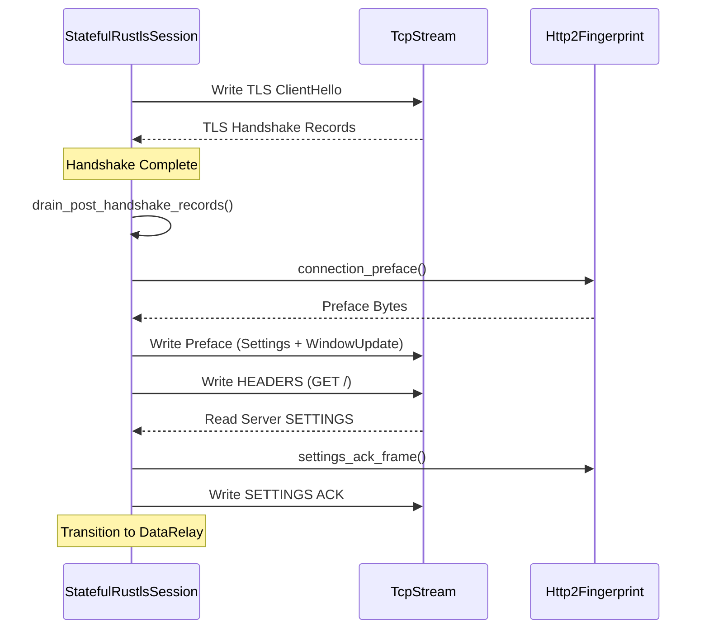

# HTTP/2 Fingerprinting
Relevant source files

- [src/fingerprint/http2.rs](https://github.com/yuzeguitarist/ParallaX/blob/77045cea/src/fingerprint/http2.rs)
- [src/fingerprint/mod.rs](https://github.com/yuzeguitarist/ParallaX/blob/77045cea/src/fingerprint/mod.rs)
- [src/tls/stateful.rs](https://github.com/yuzeguitarist/ParallaX/blob/77045cea/src/tls/stateful.rs)

The HTTP/2 fingerprinting layer in ParallaX ensures that once the TLS 1.3 handshake is completed, the subsequent application-layer interaction matches the behavioral patterns of the mimicked browser. Modern middleboxes and CDNs often validate that the HTTP/2 `SETTINGS` and `WINDOW_UPDATE` frames align with the `User-Agent` or TLS fingerprint observed earlier. ParallaX automates this by constructing browser-specific connection prefaces and handling initial frame exchanges before transitioning to the data relay phase.

### HTTP/2 Peer Profiles

ParallaX defines specific profiles to match common browser behaviors. Each profile dictates the initial `SETTINGS` parameters, the connection-level flow control window, and whether priority frames are sent.

- Safari 17: Configures a smaller header table size (4096) and a large initial window increment (15,663,105) [src/fingerprint/http2.rs#39-60](https://github.com/yuzeguitarist/ParallaX/blob/77045cea/src/fingerprint/http2.rs#L39-L60)
- Chrome 124: Configures a larger header table size (65,536) and explicitly disables server push [src/fingerprint/http2.rs#61-83](https://github.com/yuzeguitarist/ParallaX/blob/77045cea/src/fingerprint/http2.rs#L61-L83)

The `Http2Fingerprint` struct encapsulates these parameters and provides methods to generate the corresponding binary frames [src/fingerprint/http2.rs#16-20](https://github.com/yuzeguitarist/ParallaX/blob/77045cea/src/fingerprint/http2.rs#L16-L20)

#### Data Mapping: Profiles to Code Entities

The following diagram illustrates how browser profiles map to specific HTTP/2 configuration constants within the codebase.

[Flowchart Diagram]

Sources: [src/fingerprint/http2.rs#4-82](https://github.com/yuzeguitarist/ParallaX/blob/77045cea/src/fingerprint/http2.rs#L4-L82)[src/fingerprint/http2.rs#36-85](https://github.com/yuzeguitarist/ParallaX/blob/77045cea/src/fingerprint/http2.rs#L36-L85)

### Connection Preface Construction

After the TLS handshake, the client must send a connection preface. In ParallaX, this is handled by `Http2Fingerprint::connection_preface`, which concatenates the mandatory string `PRI * HTTP/2.0\r\n\r\nSM\r\n\r\n` with a `SETTINGS` frame and an optional `WINDOW_UPDATE` frame [src/fingerprint/http2.rs#104-111](https://github.com/yuzeguitarist/ParallaX/blob/77045cea/src/fingerprint/http2.rs#L104-L111)

| Frame Type | Function | Description |
| --- | --- | --- |
| Preface String | Constant | Fixed 24-byte sequence required by RFC 7540. |
| SETTINGS | `settings_frame()` | Encodes ID/Value pairs like `MAX_CONCURRENT_STREAMS`[src/fingerprint/http2.rs#87-94](https://github.com/yuzeguitarist/ParallaX/blob/77045cea/src/fingerprint/http2.rs#L87-L94) |
| WINDOW_UPDATE | `initial_window_update_frame()` | Sets the connection-level flow control window [src/fingerprint/http2.rs#96-102](https://github.com/yuzeguitarist/ParallaX/blob/77045cea/src/fingerprint/http2.rs#L96-L102) |

Sources: [src/fingerprint/http2.rs#104-111](https://github.com/yuzeguitarist/ParallaX/blob/77045cea/src/fingerprint/http2.rs#L104-L111)[src/fingerprint/http2.rs#87-102](https://github.com/yuzeguitarist/ParallaX/blob/77045cea/src/fingerprint/http2.rs#L87-L102)

### HPACK and HEADERS Emulation

To appear as a legitimate browser making an initial request, ParallaX can generate a `HEADERS` frame for a `GET /` request. This involves a simplified HPACK implementation that uses indexed names for common headers and literal values for the `:authority` (SNI) [src/fingerprint/http2.rs#117-125](https://github.com/yuzeguitarist/ParallaX/blob/77045cea/src/fingerprint/http2.rs#L117-L125)

The implementation includes helper functions for HPACK integer and string encoding:

- `push_hpack_integer`: Encodes integers using the prefix-bit variable-length scheme [src/fingerprint/http2.rs#190-204](https://github.com/yuzeguitarist/ParallaX/blob/77045cea/src/fingerprint/http2.rs#L190-L204)
- `push_hpack_string`: Encodes strings (like the SNI) with their length prefix [src/fingerprint/http2.rs#185-188](https://github.com/yuzeguitarist/ParallaX/blob/77045cea/src/fingerprint/http2.rs#L185-L188)

Sources: [src/fingerprint/http2.rs#117-126](https://github.com/yuzeguitarist/ParallaX/blob/77045cea/src/fingerprint/http2.rs#L117-L126)[src/fingerprint/http2.rs#185-204](https://github.com/yuzeguitarist/ParallaX/blob/77045cea/src/fingerprint/http2.rs#L185-L204)

### Stateful Handshake Integration

The `StatefulRustlsSession` manages the transition from TLS to HTTP/2. Once the TLS handshake is complete, the runtime performs the following steps:

1. Post-Handshake Drain: Reads up to 4 records or waits 180ms to consume any Session Tickets or NewSessionTicket messages sent by the server [src/tls/stateful.rs#43-44](https://github.com/yuzeguitarist/ParallaX/blob/77045cea/src/tls/stateful.rs#L43-L44)[src/tls/stateful.rs#247-253](https://github.com/yuzeguitarist/ParallaX/blob/77045cea/src/tls/stateful.rs#L247-L253)
2. Preface Exchange: Sends the browser-specific HTTP/2 preface [src/tls/stateful.rs#257-258](https://github.com/yuzeguitarist/ParallaX/blob/77045cea/src/tls/stateful.rs#L257-L258)
3. SETTINGS ACK Handling: The client waits for the server's `SETTINGS` frame and responds with a `SETTINGS ACK`[src/tls/stateful.rs#260-265](https://github.com/yuzeguitarist/ParallaX/blob/77045cea/src/tls/stateful.rs#L260-L265)
4. Initial Request: Sends a `HEADERS` frame for the root path (`/`) to simulate a browser page load [src/tls/stateful.rs#271-274](https://github.com/yuzeguitarist/ParallaX/blob/77045cea/src/tls/stateful.rs#L271-L274)

#### Handshake to HTTP/2 Data Flow

This diagram shows the sequence of operations from the end of TLS to the establishment of the ParallaX data session.

Sources: [src/tls/stateful.rs#208-278](https://github.com/yuzeguitarist/ParallaX/blob/77045cea/src/tls/stateful.rs#L208-L278)[src/fingerprint/http2.rs#104-126](https://github.com/yuzeguitarist/ParallaX/blob/77045cea/src/fingerprint/http2.rs#L104-L126)

### Frame Parsing and Validation

The `Http2FrameHeader` struct is used to parse incoming frames from the server during the initial exchange. It validates frame lengths and identifies `SETTINGS` frames to ensure the protocol state machine remains synchronized [src/fingerprint/http2.rs#128-161](https://github.com/yuzeguitarist/ParallaX/blob/77045cea/src/fingerprint/http2.rs#L128-L161)

- `parse_complete`: Attempts to parse a full HTTP/2 frame from a byte buffer, returning the header and the total frame length [src/fingerprint/http2.rs#131-152](https://github.com/yuzeguitarist/ParallaX/blob/77045cea/src/fingerprint/http2.rs#L131-L152)
- `is_settings_ack`: Specifically checks for the ACK flag (0x1) on a settings frame [src/fingerprint/http2.rs#158-160](https://github.com/yuzeguitarist/ParallaX/blob/77045cea/src/fingerprint/http2.rs#L158-L160)

Sources: [src/fingerprint/http2.rs#128-161](https://github.com/yuzeguitarist/ParallaX/blob/77045cea/src/fingerprint/http2.rs#L128-L161)