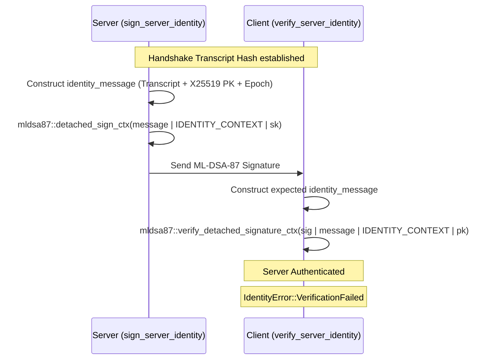

# Post-Quantum Cryptography (ML-KEM & ML-DSA)
Relevant source files

- [src/crypto/identity.rs](https://github.com/yuzeguitarist/ParallaX/blob/77045cea/src/crypto/identity.rs)
- [src/crypto/mod.rs](https://github.com/yuzeguitarist/ParallaX/blob/77045cea/src/crypto/mod.rs)
- [src/crypto/pq.rs](https://github.com/yuzeguitarist/ParallaX/blob/77045cea/src/crypto/pq.rs)
- [src/crypto/replay.rs](https://github.com/yuzeguitarist/ParallaX/blob/77045cea/src/crypto/replay.rs)

ParallaX incorporates FIPS-standardized Post-Quantum Cryptography (PQC) to protect against "harvest now, decrypt later" attacks. This layer provides quantum-resistant key encapsulation for session rekeying and quantum-resistant digital signatures for server identity verification.

## ML-KEM Key Encapsulation

ParallaX uses ML-KEM-1024 (formerly Kyber-1024) for its Key Encapsulation Mechanism (KEM) [src/crypto/pq.rs#2](https://github.com/yuzeguitarist/ParallaX/blob/77045cea/src/crypto/pq.rs#L2-L2) This provides a NIST Security Category 5 level of protection, equivalent to AES-256.

### Encapsulation & Decapsulation

The PQC layer provides two primary operations to establish a shared secret:

1. `encapsulate`: Takes an ML-KEM public key and produces a ciphertext and a 32-byte shared secret [src/crypto/pq.rs#43-51](https://github.com/yuzeguitarist/ParallaX/blob/77045cea/src/crypto/pq.rs#L43-L51)
2. `decapsulate`: Takes a ciphertext and a secret key to recover the same 32-byte shared secret [src/crypto/pq.rs#53-60](https://github.com/yuzeguitarist/ParallaX/blob/77045cea/src/crypto/pq.rs#L53-L60)

### Hybrid Sandwich Rekeying

To ensure security even if the quantum-resistant algorithm is compromised, ParallaX employs a Hybrid Sandwich construction for key derivation [src/crypto/pq.rs#75-95](https://github.com/yuzeguitarist/ParallaX/blob/77045cea/src/crypto/pq.rs#L75-L95) This construction mixes classical secrets (X25519), quantum-resistant secrets (ML-KEM), and optional symmetric pre-shared keys (PSK) into the new chain secret.

The Input Key Material (IKM) for the HKDF-SHA256 extraction is structured as follows:
`"x25519:" || x25519_secret || "|mlkem1024:" || pq_secret || "|psk:" || psk_len || psk_material`

### Data Flow: Hybrid Rekeying

The following diagram illustrates how multiple entropy sources are combined into the post-quantum chain secret.

Hybrid Sandwich Construction

[Flowchart Diagram]

Sources:[src/crypto/pq.rs#75-95](https://github.com/yuzeguitarist/ParallaX/blob/77045cea/src/crypto/pq.rs#L75-L95)[src/crypto/pq.rs#62-73](https://github.com/yuzeguitarist/ParallaX/blob/77045cea/src/crypto/pq.rs#L62-L73)

---

## ML-DSA Server Identity Proofs

For server authentication, ParallaX utilizes ML-DSA-87 (formerly Dilithium5) [src/crypto/identity.rs#1](https://github.com/yuzeguitarist/ParallaX/blob/77045cea/src/crypto/identity.rs#L1-L1) This ensures that even a quantum-capable adversary cannot spoof the server's identity during the handshake.

### Identity Message Construction

The server signs a specific `identity_message` that binds the session's transcript to the server's ephemeral keys and the current epoch [src/crypto/identity.rs#38-51](https://github.com/yuzeguitarist/ParallaX/blob/77045cea/src/crypto/identity.rs#L38-L51) The message contains:

- A static label: `ParallaX v1 server identity proof`[src/crypto/identity.rs#10](https://github.com/yuzeguitarist/ParallaX/blob/77045cea/src/crypto/identity.rs#L10-L10)
- The current `epoch` (u64).
- The `transcript_hash` of the handshake.
- The server's ephemeral `x25519_public_key`.

### Sign and Verify

- `sign_server_identity`: Uses the ML-DSA-87 secret key and a context string (`ParallaX v1 ML-DSA-87 server identity`) to generate a detached signature [src/crypto/identity.rs#53-64](https://github.com/yuzeguitarist/ParallaX/blob/77045cea/src/crypto/identity.rs#L53-L64)
- `verify_server_identity`: Validates the signature against the reconstructed identity message and the server's public key [src/crypto/identity.rs#66-80](https://github.com/yuzeguitarist/ParallaX/blob/77045cea/src/crypto/identity.rs#L66-L80)

Identity Verification Data Flow

Sources:[src/crypto/identity.rs#9-10](https://github.com/yuzeguitarist/ParallaX/blob/77045cea/src/crypto/identity.rs#L9-L10)[src/crypto/identity.rs#38-51](https://github.com/yuzeguitarist/ParallaX/blob/77045cea/src/crypto/identity.rs#L38-L51)[src/crypto/identity.rs#53-80](https://github.com/yuzeguitarist/ParallaX/blob/77045cea/src/crypto/identity.rs#L53-L80)

---

## Key Management and Zeroization

Security of post-quantum primitives is maintained through strict memory management and key pair structures.

### Key Pair Structures

Both ML-KEM and ML-DSA use specialized key pair structures that implement the `Zeroize` and `ZeroizeOnDrop` traits to ensure sensitive material is wiped from memory after use.

| Structure | Algorithm | Usage |
| --- | --- | --- |
| `MlKemKeyPair` | ML-KEM-1024 | Session Rekeying [src/crypto/pq.rs#23-27](https://github.com/yuzeguitarist/ParallaX/blob/77045cea/src/crypto/pq.rs#L23-L27) |
| `MlDsaKeyPair` | ML-DSA-87 | Server Identity [src/crypto/identity.rs#24-28](https://github.com/yuzeguitarist/ParallaX/blob/77045cea/src/crypto/identity.rs#L24-L28) |

### Memory Safety

The `hybrid_sandwich_rekey` function explicitly calls `ikm.zeroize()`[src/crypto/pq.rs#93](https://github.com/yuzeguitarist/ParallaX/blob/77045cea/src/crypto/pq.rs#L93-L93) after the HKDF extraction is complete to prevent the combined secret material from lingering in the heap.

Sources:[src/crypto/pq.rs#23-27](https://github.com/yuzeguitarist/ParallaX/blob/77045cea/src/crypto/pq.rs#L23-L27)[src/crypto/pq.rs#93](https://github.com/yuzeguitarist/ParallaX/blob/77045cea/src/crypto/pq.rs#L93-L93)[src/crypto/identity.rs#24-28](https://github.com/yuzeguitarist/ParallaX/blob/77045cea/src/crypto/identity.rs#L24-L28)

---

## Code Mapping: Natural Language to Implementation

This table maps cryptographic concepts to their specific implementation entities within the ParallaX codebase.

| Concept | Code Entity | File Path |
| --- | --- | --- |
| PQ Rekeying | `hybrid_sandwich_rekey` | [src/crypto/pq.rs#75](https://github.com/yuzeguitarist/ParallaX/blob/77045cea/src/crypto/pq.rs#L75-L75) |
| KEM Encapsulation | `encapsulate` | [src/crypto/pq.rs#43](https://github.com/yuzeguitarist/ParallaX/blob/77045cea/src/crypto/pq.rs#L43-L43) |
| KEM Decapsulation | `decapsulate` | [src/crypto/pq.rs#53](https://github.com/yuzeguitarist/ParallaX/blob/77045cea/src/crypto/pq.rs#L53-L53) |
| Server Identity Signing | `sign_server_identity` | [src/crypto/identity.rs#53](https://github.com/yuzeguitarist/ParallaX/blob/77045cea/src/crypto/identity.rs#L53-L53) |
| Server Identity Verification | `verify_server_identity` | [src/crypto/identity.rs#66](https://github.com/yuzeguitarist/ParallaX/blob/77045cea/src/crypto/identity.rs#L66-L66) |
| Identity Context | `IDENTITY_CONTEXT` | [src/crypto/identity.rs#9](https://github.com/yuzeguitarist/ParallaX/blob/77045cea/src/crypto/identity.rs#L9-L9) |
| PQ Key Generation | `pq::keypair` / `identity::keypair` | [src/crypto/pq.rs#35](https://github.com/yuzeguitarist/ParallaX/blob/77045cea/src/crypto/pq.rs#L35-L35)[src/crypto/identity.rs#30](https://github.com/yuzeguitarist/ParallaX/blob/77045cea/src/crypto/identity.rs#L30-L30) |

Sources:[src/crypto/pq.rs#1-104](https://github.com/yuzeguitarist/ParallaX/blob/77045cea/src/crypto/pq.rs#L1-L104)[src/crypto/identity.rs#1-80](https://github.com/yuzeguitarist/ParallaX/blob/77045cea/src/crypto/identity.rs#L1-L80)