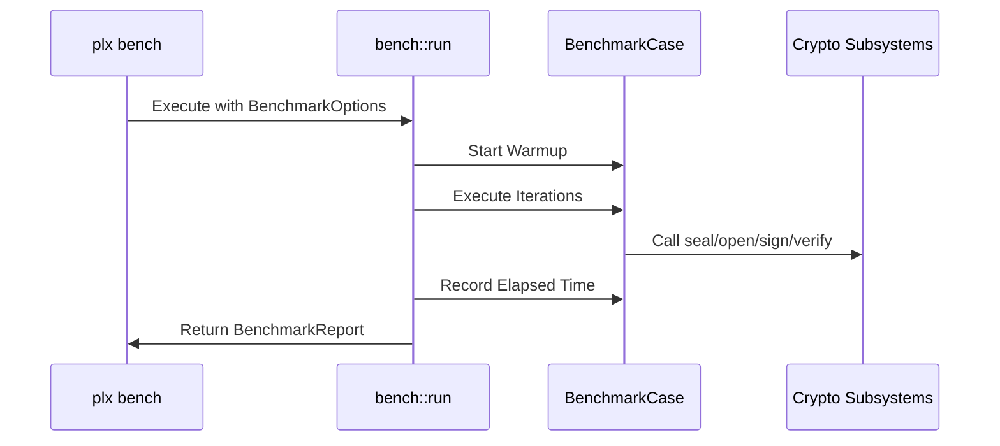

# Probing & Benchmarking
Relevant source files

- [src/bench.rs](https://github.com/yuzeguitarist/ParallaX/blob/77045cea/src/bench.rs)
- [src/probe.rs](https://github.com/yuzeguitarist/ParallaX/blob/77045cea/src/probe.rs)

The ParallaX toolkit provides built-in utilities for evaluating the suitability of camouflage targets and measuring the performance overhead of cryptographic operations. These tools ensure that operators can select optimal decoy domains and verify that the protocol's performance meets deployment requirements.

### System Overview

The evaluation suite is divided into two primary functional areas:

1. Target Probing: Active network analysis of potential camouflage destinations to ensure they support the necessary TLS features (e.g., TLS 1.3, ALPN `h2`).
2. Performance Benchmarking: Micro-benchmarking of the core cryptographic and protocol-level operations to identify bottlenecks.

### Component Relationship

The following diagram illustrates how the probing and benchmarking logic interacts with the core protocol entities.

Evaluation Architecture

[Flowchart Diagram]

Sources:[src/probe.rs#44-69](https://github.com/yuzeguitarist/ParallaX/blob/77045cea/src/probe.rs#L44-L69)[src/bench.rs#31-72](https://github.com/yuzeguitarist/ParallaX/blob/77045cea/src/bench.rs#L31-L72)[src/bench.rs#160-168](https://github.com/yuzeguitarist/ParallaX/blob/77045cea/src/bench.rs#L160-L168)

---

## 7.1 Camouflage Target Probe

The `plx probe` utility is used to validate whether a specific domain can serve as a high-quality camouflage target. It performs a real TLS handshake and analyzes the server's response patterns to assign a quality score.

### Key Metrics and Scoring

The probe evaluates several signals to determine a `ProbeVerdict` (Good, Usable, or Bad):

- TCP Latency: Measures the initial connection speed [src/probe.rs#212](https://github.com/yuzeguitarist/ParallaX/blob/77045cea/src/probe.rs#L212-L212)
- TLS 1.3 Support: Verifies if the target supports the modern TLS 1.3 protocol required by ParallaX [src/probe.rs#231-235](https://github.com/yuzeguitarist/ParallaX/blob/77045cea/src/probe.rs#L231-L235)
- ALPN Negotiation: Checks for `h2` (HTTP/2) support to improve browser mimicry [src/probe.rs#236-238](https://github.com/yuzeguitarist/ParallaX/blob/77045cea/src/probe.rs#L236-L238)
- Post-Handshake Records: Counts session tickets or other records sent immediately after the handshake to ensure the `PostHandshakeDrain` logic will behave correctly [src/probe.rs#239-242](https://github.com/yuzeguitarist/ParallaX/blob/77045cea/src/probe.rs#L239-L242)

For details on the scoring algorithm and verifier implementation, see [Camouflage Target Probe](#7.1).

Sources:[src/probe.rs#50-55](https://github.com/yuzeguitarist/ParallaX/blob/77045cea/src/probe.rs#L50-L55)[src/probe.rs#58-69](https://github.com/yuzeguitarist/ParallaX/blob/77045cea/src/probe.rs#L58-L69)[src/probe.rs#194-245](https://github.com/yuzeguitarist/ParallaX/blob/77045cea/src/probe.rs#L194-L245)

---

## 7.2 Protocol Benchmarks

The `plx bench` utility provides high-precision measurements of the internal components. It allows developers to quantify the latency and throughput of the ParallaX cryptographic stack.

### Benchmark Cases

The suite covers five critical performance areas:

1. ClientHello Camouflage: Measures the time to build and sign a signed ClientHello [src/bench.rs#177-204](https://github.com/yuzeguitarist/ParallaX/blob/77045cea/src/bench.rs#L177-L204)
2. DataRecordCodec: Evaluates the `seal` and `open` operations, including AEAD encryption and padding overhead [src/bench.rs#206-233](https://github.com/yuzeguitarist/ParallaX/blob/77045cea/src/bench.rs#L206-L233)
3. ML-KEM: Benchmarks the Post-Quantum Key Encapsulation Mechanism (encapsulation/decapsulation) [src/bench.rs#235-256](https://github.com/yuzeguitarist/ParallaX/blob/77045cea/src/bench.rs#L235-L256)
4. ReplayCache: Measures the overhead of insertion and lookups in the `ReplayCache`[src/bench.rs#258-278](https://github.com/yuzeguitarist/ParallaX/blob/77045cea/src/bench.rs#L258-L278)
5. Salamander: Tests the performance of the BLAKE2b-based QUIC packet obfuscator [src/bench.rs#280-302](https://github.com/yuzeguitarist/ParallaX/blob/77045cea/src/bench.rs#L280-L302)

Benchmark Flow

Sources:[src/bench.rs#160-175](https://github.com/yuzeguitarist/ParallaX/blob/77045cea/src/bench.rs#L160-L175)[src/bench.rs#304-326](https://github.com/yuzeguitarist/ParallaX/blob/77045cea/src/bench.rs#L304-L326)

For details on execution options and report formats (Text/JSON), see [Protocol Benchmarks](#7.2).

Sources:[src/bench.rs#31-36](https://github.com/yuzeguitarist/ParallaX/blob/77045cea/src/bench.rs#L31-L36)[src/bench.rs#74-131](https://github.com/yuzeguitarist/ParallaX/blob/77045cea/src/bench.rs#L74-L131)