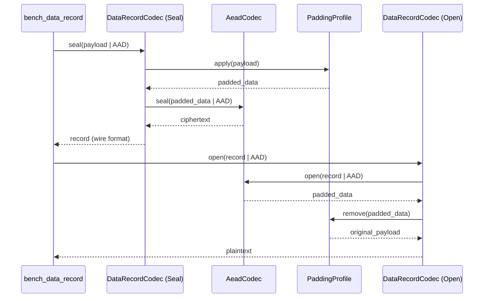

# Protocol Benchmarks
Relevant source files

- [src/bench.rs](https://github.com/yuzeguitarist/ParallaX/blob/77045cea/src/bench.rs)
- [src/cli.rs](https://github.com/yuzeguitarist/ParallaX/blob/77045cea/src/cli.rs)

The `plx bench` command provides a suite of local, CPU-only performance measurements for the critical cryptographic and protocol-processing paths in ParallaX. These benchmarks allow developers to evaluate the overhead of camouflage construction, post-quantum operations, and traffic obfuscation without the noise of network latency [src/cli.rs#63-64](https://github.com/yuzeguitarist/ParallaX/blob/77045cea/src/cli.rs#L63-L64)

## Benchmark Configuration and Execution

Benchmarks are configured via `BenchmarkOptions`, which defines the execution parameters for each test case.

| Field | Type | Description |
| --- | --- | --- |
| `iterations` | `u64` | Number of timed executions per case (default: 1,000) [src/bench.rs#60](https://github.com/yuzeguitarist/ParallaX/blob/77045cea/src/bench.rs#L60-L60) |
| `warmup` | `u64` | Number of untimed executions to prime the CPU cache (default: 100) [src/bench.rs#61](https://github.com/yuzeguitarist/ParallaX/blob/77045cea/src/bench.rs#L61-L61) |
| `payload_size` | `usize` | Size of the plaintext data for throughput-based benchmarks (default: 1,024) [src/bench.rs#62](https://github.com/yuzeguitarist/ParallaX/blob/77045cea/src/bench.rs#L62-L62) |

The execution flow is managed by `bench::run`, which sequences five distinct benchmark cases and aggregates the results into a `BenchmarkReport`[src/bench.rs#160-175](https://github.com/yuzeguitarist/ParallaX/blob/77045cea/src/bench.rs#L160-L175)

### Benchmark Execution Flow

The following diagram illustrates how the `Benchmark` command is dispatched from the CLI to the individual case logic.

[Flowchart Diagram]

Sources: [src/cli.rs#162-175](https://github.com/yuzeguitarist/ParallaX/blob/77045cea/src/cli.rs#L162-L175)[src/bench.rs#160-175](https://github.com/yuzeguitarist/ParallaX/blob/77045cea/src/bench.rs#L160-L175)

---

## Benchmark Cases

### 1. ClientHello Camouflage (`tls_clienthello_auth`)

This case measures the end-to-end latency of the ParallaX authentication handshake. It includes:

1. Client-side: Generating an X25519 ephemeral key, deriving the client authentication key, and building a signed TLS ClientHello using `NativeCamouflageBackend`[src/bench.rs#185-192](https://github.com/yuzeguitarist/ParallaX/blob/77045cea/src/bench.rs#L185-L192)
2. Server-side: Parsing the ClientHello, deriving the server authentication key, and performing `verify_client_hello_auth` to validate the session ID tag [src/bench.rs#193-197](https://github.com/yuzeguitarist/ParallaX/blob/77045cea/src/bench.rs#L193-L197)

### 2. DataRecordCodec (`data_record_seal_open`)

This case measures the throughput of the primary data transport layer. It benchmarks the `DataRecordCodec` by performing a full `seal` (encryption + padding) and `open` (decryption + padding removal) cycle [src/bench.rs#206-228](https://github.com/yuzeguitarist/ParallaX/blob/77045cea/src/bench.rs#L206-L228)

- Padding: Uses the `PaddingProfile` to simulate real-world packet sizing [src/bench.rs#209](https://github.com/yuzeguitarist/ParallaX/blob/77045cea/src/bench.rs#L209-L209)
- AEAD: Uses `AeadCodec` (XChaCha20-Poly1305) [src/bench.rs#212](https://github.com/yuzeguitarist/ParallaX/blob/77045cea/src/bench.rs#L212-L212)

### 3. ML-KEM Encapsulation (`mlkem_1024_encaps`)

This case benchmarks the post-quantum layer, specifically the ML-KEM-1024 primitive used during the PQ rekey step. It measures the time taken to generate a shared secret and a ciphertext [src/bench.rs#238-246](https://github.com/yuzeguitarist/ParallaX/blob/77045cea/src/bench.rs#L238-L246)

- Entity: Calls `pq::mlkem::encapsulate` using the server's public key [src/bench.rs#244](https://github.com/yuzeguitarist/ParallaX/blob/77045cea/src/bench.rs#L244-L244)

### 4. ReplayCache Insertion (`replay_cache_insert`)

This case evaluates the performance of the `ReplayCache` under load. It measures the overhead of inserting a `ReplayEntry` and checking for duplicates within a `VecDeque` + `HashSet` structure [src/bench.rs#256-267](https://github.com/yuzeguitarist/ParallaX/blob/77045cea/src/bench.rs#L256-L267)

- Entity: Calls `ReplayCache::insert_new` with a simulated nonce and transcript fingerprint [src/bench.rs#264](https://github.com/yuzeguitarist/ParallaX/blob/77045cea/src/bench.rs#L264-L264)

### 5. Salamander QUIC Obfuscation (`quic_salamander_obfuscate`)

This case benchmarks the `Salamander` obfuscator used in the QUIC transport mode. It measures the performance of the BLAKE2b-based packet header and payload masking [src/bench.rs#276-291](https://github.com/yuzeguitarist/ParallaX/blob/77045cea/src/bench.rs#L276-L291)

- Entity: Calls `Salamander::obfuscate` and `Salamander::deobfuscate` on a packet buffer [src/bench.rs#286-288](https://github.com/yuzeguitarist/ParallaX/blob/77045cea/src/bench.rs#L286-L288)

---

## Data Flow: DataRecordCodec Benchmark

The `DataRecordCodec` benchmark is the most complex case, as it involves the full transformation of application data into obfuscated wire records.



Sources: [src/bench.rs#206-231](https://github.com/yuzeguitarist/ParallaX/blob/77045cea/src/bench.rs#L206-L231)[src/protocol/data.rs#18](https://github.com/yuzeguitarist/ParallaX/blob/77045cea/src/protocol/data.rs#L18-L18)[src/traffic.rs#24](https://github.com/yuzeguitarist/ParallaX/blob/77045cea/src/traffic.rs#L24-L24)

---

## Reporting and Metrics

The `BenchmarkReport` provides both human-readable text and machine-readable JSON outputs.

### Key Metrics

- Average Duration: Calculated as `total_elapsed / iterations`[src/bench.rs#145](https://github.com/yuzeguitarist/ParallaX/blob/77045cea/src/bench.rs#L145-L145)
- Ops/Sec: Throughput in terms of operations per second [src/bench.rs#149](https://github.com/yuzeguitarist/ParallaX/blob/77045cea/src/bench.rs#L149-L149)
- MiB/Sec: Throughput in terms of data processed (relevant for `DataRecordCodec` and `Salamander`) [src/bench.rs#152-157](https://github.com/yuzeguitarist/ParallaX/blob/77045cea/src/bench.rs#L152-L157)

### Example Output Structure

```
ParallaX benchmark: iterations=1000, warmup=100, payload=1024 bytes
case                               iters          avg        ops/sec        MiB/sec          total
tls_clienthello_auth                1000     250.45µs        3992.81           1.84       250.45ms
data_record_seal_open               1000      15.20µs       65789.47          64.25        15.20ms
mlkem_1024_encaps                   1000      42.10µs       23752.97           0.00        42.10ms
...
```

Sources: [src/bench.rs#75-101](https://github.com/yuzeguitarist/ParallaX/blob/77045cea/src/bench.rs#L75-L101)

Sources:

- `src/cli.rs`: CLI command definitions and dispatch logic.
- `src/bench.rs`: Benchmark execution logic, options, and reporting.
- `src/protocol/data.rs`: `DataRecordCodec` implementation.
- `src/crypto/session.rs`: `AeadCodec` and X25519 key management.
- `src/crypto/pq.rs`: Post-quantum primitives (ML-KEM).
- `src/crypto/replay.rs`: `ReplayCache` implementation.
- `src/transport/quic.rs`: `Salamander` QUIC obfuscator.
- `src/traffic.rs`: `PaddingProfile` for traffic shaping.