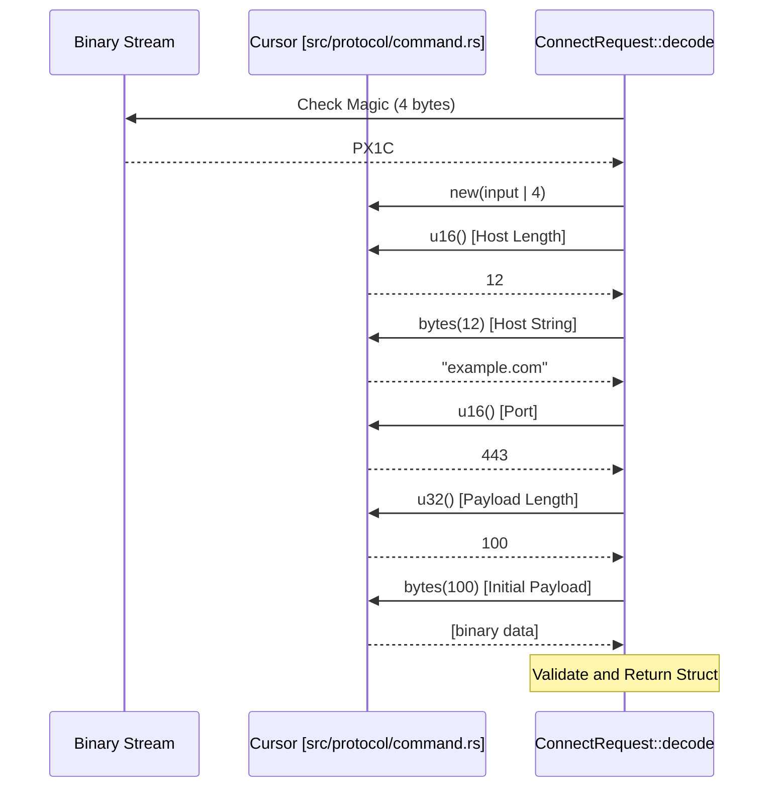

# Protocol Commands & Data Records
Relevant source files

- [src/protocol/command.rs](https://github.com/yuzeguitarist/ParallaX/blob/77045cea/src/protocol/command.rs)
- [src/protocol/data.rs](https://github.com/yuzeguitarist/ParallaX/blob/77045cea/src/protocol/data.rs)
- [src/protocol/mod.rs](https://github.com/yuzeguitarist/ParallaX/blob/77045cea/src/protocol/mod.rs)
- [src/tls/record.rs](https://github.com/yuzeguitarist/ParallaX/blob/77045cea/src/tls/record.rs)

This page details the wire format and codec implementation for the ParallaX protocol. It covers the binary layout of control commands used during the handshake phase and the secure framing of application data records.

## Protocol Command Messages

ParallaX utilizes a set of binary-encoded commands to facilitate connection establishment, post-quantum rekeying, and server authentication. Each command begins with a 4-byte magic sequence to identify the message type.

### Command Binary Layouts

| Message Type | Magic Bytes | Purpose | Structure |
| --- | --- | --- | --- |
| `ConnectRequest` | `PX1C` | Initiates a proxy connection to a target host/port. | `Magic` (4B) \| `HostLen` (2B) \| `Host` (v) \| `Port` (2B) \| `PayloadLen` (4B) \| `Payload` (v) |
| `PqRekeyRequest` | `PX1Q` | Performs ML-KEM-1024 key encapsulation. | `Magic` (4B) \| `CiphertextLen` (4B) \| `Ciphertext` (v) |
| `ServerIdentityProof` | `PX1S` | Provides an ML-DSA-87 signature of the transcript. | `Magic` (4B) \| `SigLen` (4B) \| `Signature` (v) |

### Implementation Details

The `ConnectRequest` struct handles the initial proxy instruction. It supports both domain names and IP addresses, providing a `target()` helper to format the destination for standard socket operations `<FileRef file-url="https://github.com/yuzeguitarist/ParallaX/blob/77045cea/src/protocol/command.rs#L67-L73" min=67 max=73 file-path="src/protocol/command.rs">Hii</FileRef>`.

- Host Constraints: The host string is limited to a maximum of 255 bytes `<FileRef file-url="https://github.com/yuzeguitarist/ParallaX/blob/77045cea/src/protocol/command.rs#L6-L6" min=6  file-path="src/protocol/command.rs">Hii</FileRef>`.
- Encoding: All multi-byte integers (lengths and ports) are encoded in Big-Endian (Network Byte Order) `<FileRef file-url="https://github.com/yuzeguitarist/ParallaX/blob/77045cea/src/protocol/command.rs#L89-L92" min=89 max=92 file-path="src/protocol/command.rs">Hii</FileRef>`.
- Initial Payload: The request can carry an initial chunk of application data (e.g., a SOCKS5 header or HTTP request) to reduce round-trips `<FileRef file-url="https://github.com/yuzeguitarist/ParallaX/blob/77045cea/src/protocol/command.rs#L12-L12" min=12  file-path="src/protocol/command.rs">Hii</FileRef>`.

The `PqRekeyRequest``<FileRef file-url="https://github.com/yuzeguitarist/ParallaX/blob/77045cea/src/protocol/command.rs#L34-L36" min=34 max=36 file-path="src/protocol/command.rs">Hii</FileRef>` and `ServerIdentityProof``<FileRef file-url="https://github.com/yuzeguitarist/ParallaX/blob/77045cea/src/protocol/command.rs#L39-L41" min=39 max=41 file-path="src/protocol/command.rs">Hii</FileRef>` structures serve as simple containers for the cryptographic material generated during the hybrid handshake.

Sources:

- `<FileRef file-url="https://github.com/yuzeguitarist/ParallaX/blob/77045cea/src/protocol/command.rs#L3-L5" min=3 max=5 file-path="src/protocol/command.rs">Hii</FileRef>` (Magic constants)
- `<FileRef file-url="https://github.com/yuzeguitarist/ParallaX/blob/77045cea/src/protocol/command.rs#L9-L13" min=9 max=13 file-path="src/protocol/command.rs">Hii</FileRef>` (`ConnectRequest` definition)
- `<FileRef file-url="https://github.com/yuzeguitarist/ParallaX/blob/77045cea/src/protocol/command.rs#L75-L95" min=75 max=95 file-path="src/protocol/command.rs">Hii</FileRef>` (`ConnectRequest::encode`)
- `<FileRef file-url="https://github.com/yuzeguitarist/ParallaX/blob/77045cea/src/protocol/command.rs#L137-L170" min=137 max=170 file-path="src/protocol/command.rs">Hii</FileRef>` (`PqRekeyRequest` implementation)
- `<FileRef file-url="https://github.com/yuzeguitarist/ParallaX/blob/77045cea/src/protocol/command.rs#L172-L205" min=172 max=205 file-path="src/protocol/command.rs">Hii</FileRef>` (`ServerIdentityProof` implementation)

---

## Data Record Codec

The `DataRecordCodec` is responsible for transforming raw application bytes into encrypted, padded TLS records. This layer ensures that ParallaX traffic is indistinguishable from standard TLS 1.3 `ApplicationData` packets.

### Data Flow: Seal & Open

The codec operates in two directions: `seal` (encrypt/pad/wrap) and `open` (unwrap/decrypt/unpad).

#### Codec Entity Relationship

This diagram maps the `DataRecordCodec` operations to the internal components and constants.

[Flowchart Diagram]

### TLS Record Framing

ParallaX wraps all application data in standard TLS record headers to satisfy deep packet inspection (DPI) middleboxes.

1. Header: 5 bytes containing Content Type (`0x17` for Application Data), Legacy Version (`0x0303` for TLS 1.2 compatibility), and a 2-byte Big-Endian length `<FileRef file-url="https://github.com/yuzeguitarist/ParallaX/blob/77045cea/src/tls/record.rs#L4-L7" min=4 max=7 file-path="src/tls/record.rs">Hii</FileRef>`.
2. Maximum Payload: The codec respects the standard TLS limit of 16,384 bytes (`MAX_TLS_RECORD_PAYLOAD`) `<FileRef file-url="https://github.com/yuzeguitarist/ParallaX/blob/77045cea/src/tls/record.rs#L9-L9" min=9  file-path="src/tls/record.rs">Hii</FileRef>`.
3. AAD (Additional Authenticated Data): To prevent cross-protocol attacks or direction reflection, unique AAD constants are bound to the AEAD operation:

- `CLIENT_TO_SERVER_AAD`: `b"ParallaX v1 client appdata"``<FileRef file-url="https://github.com/yuzeguitarist/ParallaX/blob/77045cea/src/protocol/data.rs#L62-L62" min=62  file-path="src/protocol/data.rs">Hii</FileRef>`
- `SERVER_TO_CLIENT_AAD`: `b"ParallaX v1 server appdata"``<FileRef file-url="https://github.com/yuzeguitarist/ParallaX/blob/77045cea/src/protocol/data.rs#L63-L63" min=63  file-path="src/protocol/data.rs">Hii</FileRef>`

### Padding and Capacity

To resist traffic analysis, the codec applies padding via `PaddingProfile` before encryption. Because padding and AEAD tags (16 bytes) consume space, the effective maximum plaintext length is calculated dynamically.

- Plaintext Calculation: `MAX_TLS_RECORD_PAYLOAD - (Padding + AEAD_TAG_LEN + PADDING_LEN_FIELD)``<FileRef file-url="https://github.com/yuzeguitarist/ParallaX/blob/77045cea/src/protocol/data.rs#L65-L68" min=65 max=68 file-path="src/protocol/data.rs">Hii</FileRef>`.
- Padding Header: A 2-byte field is used within the encrypted envelope to denote the length of the padding applied `<FileRef file-url="https://github.com/yuzeguitarist/ParallaX/blob/77045cea/src/protocol/data.rs#L10-L10" min=10  file-path="src/protocol/data.rs">Hii</FileRef>`.

Sources:

- `<FileRef file-url="https://github.com/yuzeguitarist/ParallaX/blob/77045cea/src/protocol/data.rs#L24-L28" min=24 max=28 file-path="src/protocol/data.rs">Hii</FileRef>` (`DataRecordCodec` struct)
- `<FileRef file-url="https://github.com/yuzeguitarist/ParallaX/blob/77045cea/src/protocol/data.rs#L35-L42" min=35 max=42 file-path="src/protocol/data.rs">Hii</FileRef>` (`seal` implementation)
- `<FileRef file-url="https://github.com/yuzeguitarist/ParallaX/blob/77045cea/src/protocol/data.rs#L44-L55" min=44 max=55 file-path="src/protocol/data.rs">Hii</FileRef>` (`open` implementation)
- `<FileRef file-url="https://github.com/yuzeguitarist/ParallaX/blob/77045cea/src/tls/record.rs#L55-L66" min=55 max=66 file-path="src/tls/record.rs">Hii</FileRef>` (`wrap_application_data` logic)

---

## Command Processing Flow

The following diagram illustrates how the `Cursor` utility `<FileRef file-url="https://github.com/yuzeguitarist/ParallaX/blob/77045cea/src/protocol/command.rs#L207-L210" min=207 max=210 file-path="src/protocol/command.rs">Hii</FileRef>` is used during the decoding of complex commands like `ConnectRequest`.

Sources:

- `<FileRef file-url="https://github.com/yuzeguitarist/ParallaX/blob/77045cea/src/protocol/command.rs#L97-L134" min=97 max=134 file-path="src/protocol/command.rs">Hii</FileRef>` (`ConnectRequest::decode` logic)
- `<FileRef file-url="https://github.com/yuzeguitarist/ParallaX/blob/77045cea/src/protocol/command.rs#L207-L220" min=207 max=220 file-path="src/protocol/command.rs">Hii</FileRef>` (`Cursor` utility)
- `<FileRef file-url="https://github.com/yuzeguitarist/ParallaX/blob/77045cea/src/tls/record.rs#L76-L96" min=76 max=96 file-path="src/tls/record.rs">Hii</FileRef>` (`read_record` async utility)