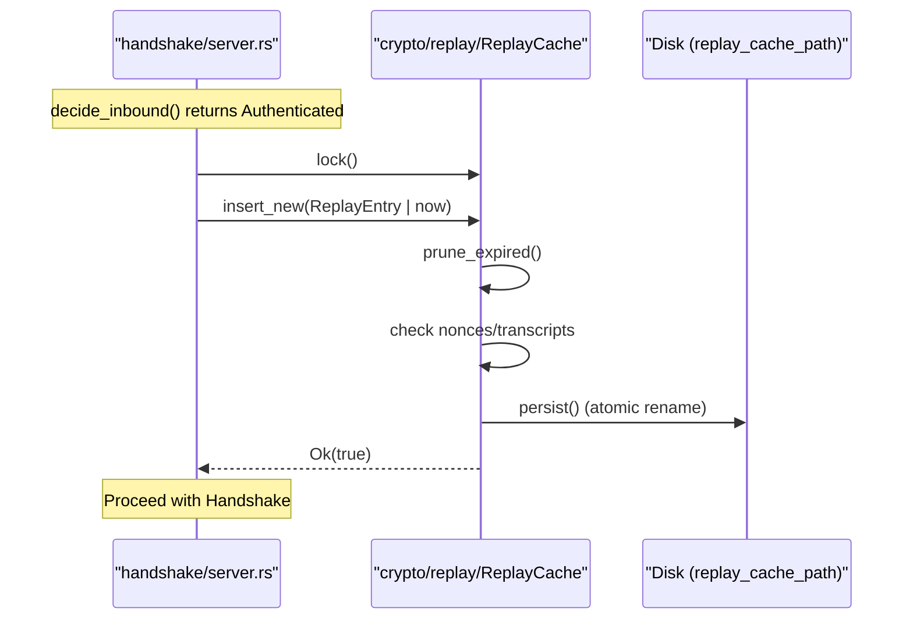

# Replay Protection
Relevant source files

- [src/crypto/identity.rs](https://github.com/yuzeguitarist/ParallaX/blob/77045cea/src/crypto/identity.rs)
- [src/crypto/mod.rs](https://github.com/yuzeguitarist/ParallaX/blob/77045cea/src/crypto/mod.rs)
- [src/crypto/replay.rs](https://github.com/yuzeguitarist/ParallaX/blob/77045cea/src/crypto/replay.rs)
- [src/handshake/server.rs](https://github.com/yuzeguitarist/ParallaX/blob/77045cea/src/handshake/server.rs)
- [src/transport/mod.rs](https://github.com/yuzeguitarist/ParallaX/blob/77045cea/src/transport/mod.rs)
- [src/transport/quic_runtime.rs](https://github.com/yuzeguitarist/ParallaX/blob/77045cea/src/transport/quic_runtime.rs)

The Replay Protection subsystem in ParallaX ensures that authenticated handshake attempts and QUIC streams cannot be captured and re-sent by an adversary to perform unauthorized actions or probe the server. It utilizes a stateful `ReplayCache` to track unique identifiers from incoming requests within a sliding time window.

## Overview

ParallaX implements replay protection at two primary layers:

1. TCP Camouflage Transport: Prevents reuse of the TLS `ClientHello` by tracking the `nonce` and the `transcript_fingerprint` embedded in the authenticated `session_id`[src/handshake/server.rs#101-108](https://github.com/yuzeguitarist/ParallaX/blob/77045cea/src/handshake/server.rs#L101-L108)
2. QUIC Transport: Prevents reuse of QUIC authentication frames by tracking the 16-byte nonce sent in the `PX1U` auth frame [src/transport/quic_runtime.rs#33-36](https://github.com/yuzeguitarist/ParallaX/blob/77045cea/src/transport/quic_runtime.rs#L33-L36)

The protection mechanism relies on a combination of a mandatory timestamp (checked against a 600-second window) and a uniqueness check for nonces and transcripts [src/crypto/replay.rs#10-17](https://github.com/yuzeguitarist/ParallaX/blob/77045cea/src/crypto/replay.rs#L10-L17)

## ReplayCache Internals

The `ReplayCache` is the central data structure for tracking seen records. It uses a dual-storage approach to optimize for both expiration and fast lookups.

### Data Structures

- `VecDeque<ReplayEntry>`: Maintains the chronological order of entries to facilitate efficient pruning of expired records [src/crypto/replay.rs#36](https://github.com/yuzeguitarist/ParallaX/blob/77045cea/src/crypto/replay.rs#L36-L36)
- `HashSet<[u8; 8]>` (nonces): Provides O(1) lookup to verify if a specific nonce has been used [src/crypto/replay.rs#37](https://github.com/yuzeguitarist/ParallaX/blob/77045cea/src/crypto/replay.rs#L37-L37)
- `HashSet<[u8; 32]>` (transcripts): Provides O(1) lookup to verify if a specific `ClientHello` transcript fingerprint has been used [src/crypto/replay.rs#38](https://github.com/yuzeguitarist/ParallaX/blob/77045cea/src/crypto/replay.rs#L38-L38)

### Replay Protection Logic Flow

The following diagram illustrates how `insert_new` validates an incoming `ReplayEntry`.

Replay Validation Flow

[Flowchart Diagram]

Sources: [src/crypto/replay.rs#75-92](https://github.com/yuzeguitarist/ParallaX/blob/77045cea/src/crypto/replay.rs#L75-L92)[src/crypto/replay.rs#94-97](https://github.com/yuzeguitarist/ParallaX/blob/77045cea/src/crypto/replay.rs#L94-L97)

## ReplayEntry and Time Window

Every entry tracked by the cache is represented by a `ReplayEntry` struct.

| Field | Type | Description |
| --- | --- | --- |
| `timestamp` | `u64` | Unix timestamp of the request. Must be within +/- 600s of server time [src/crypto/replay.rs#14](https://github.com/yuzeguitarist/ParallaX/blob/77045cea/src/crypto/replay.rs#L14-L14) |
| `nonce` | `[u8; 8]` | Random bytes provided by the client to ensure uniqueness [src/crypto/replay.rs#15](https://github.com/yuzeguitarist/ParallaX/blob/77045cea/src/crypto/replay.rs#L15-L15) |
| `transcript_fingerprint` | `[u8; 32]` | SHA-256 hash of the `ClientHello` or relevant handshake context [src/crypto/replay.rs#16](https://github.com/yuzeguitarist/ParallaX/blob/77045cea/src/crypto/replay.rs#L16-L16) |

The default replay window is defined by `DEFAULT_REPLAY_WINDOW_SECS = 600`[src/crypto/replay.rs#10](https://github.com/yuzeguitarist/ParallaX/blob/77045cea/src/crypto/replay.rs#L10-L10) Requests with timestamps outside this range relative to `current_unix_timestamp()` are rejected immediately [src/crypto/replay.rs#81-85](https://github.com/yuzeguitarist/ParallaX/blob/77045cea/src/crypto/replay.rs#L81-L85)

## Persistence and Initialization

To survive server restarts, the `ReplayCache` can be persisted to disk. The server configuration specifies a `replay_cache_path`[src/handshake/server.rs#145-148](https://github.com/yuzeguitarist/ParallaX/blob/77045cea/src/handshake/server.rs#L145-L148)

- `load_or_create`: On startup, the server reads the cache file, parses each line into a `ReplayEntry`, and populates the internal sets [src/crypto/replay.rs#53-73](https://github.com/yuzeguitarist/ParallaX/blob/77045cea/src/crypto/replay.rs#L53-L73)
- Atomic Persistence: When a new entry is added, the cache is serialized to a `.tmp` file and then renamed to the target path to ensure atomicity [src/crypto/replay.rs#126-145](https://github.com/yuzeguitarist/ParallaX/blob/77045cea/src/crypto/replay.rs#L126-L145)

## System Integration

The `ReplayCache` is integrated into both the TCP and QUIC runtimes. In the TCP server, it is wrapped in an `Arc<Mutex<ReplayCache>>` to allow concurrent validation of handshakes across multiple tokio tasks [src/handshake/server.rs#145-148](https://github.com/yuzeguitarist/ParallaX/blob/77045cea/src/handshake/server.rs#L145-L148)

Code Entity Mapping: Handshake to ReplayCache

Sources: [src/handshake/server.rs#208-223](https://github.com/yuzeguitarist/ParallaX/blob/77045cea/src/handshake/server.rs#L208-L223)[src/crypto/replay.rs#141-144](https://github.com/yuzeguitarist/ParallaX/blob/77045cea/src/crypto/replay.rs#L141-L144)

### QUIC Replay Protection

In the QUIC runtime, the `ReplayCache` is used within `handle_stream` to validate the `QUIC_AUTH_MAGIC` frames [src/transport/quic_runtime.rs#182-184](https://github.com/yuzeguitarist/ParallaX/blob/77045cea/src/transport/quic_runtime.rs#L182-L184) While the mechanism is identical, the QUIC implementation focuses on the 16-byte nonce provided in the UDP-based auth frame [src/transport/quic_runtime.rs#33-36](https://github.com/yuzeguitarist/ParallaX/blob/77045cea/src/transport/quic_runtime.rs#L33-L36)

Sources:

- `src/crypto/replay.rs`[1-213](https://github.com/yuzeguitarist/ParallaX/blob/77045cea/1-213)
- `src/handshake/server.rs`[134-172](https://github.com/yuzeguitarist/ParallaX/blob/77045cea/134-172)[193-225](https://github.com/yuzeguitarist/ParallaX/blob/77045cea/193-225)
- `src/transport/quic_runtime.rs`[33-43](https://github.com/yuzeguitarist/ParallaX/blob/77045cea/33-43)[106-120](https://github.com/yuzeguitarist/ParallaX/blob/77045cea/106-120)[171-189](https://github.com/yuzeguitarist/ParallaX/blob/77045cea/171-189)