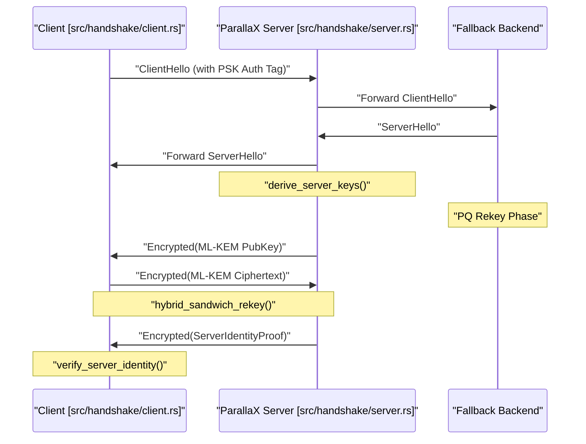

# Server Runtime & Probing Resistance
Relevant source files

- [src/handshake/client.rs](https://github.com/yuzeguitarist/ParallaX/blob/77045cea/src/handshake/client.rs)
- [src/handshake/server.rs](https://github.com/yuzeguitarist/ParallaX/blob/77045cea/src/handshake/server.rs)
- [src/handshake/transcript.rs](https://github.com/yuzeguitarist/ParallaX/blob/77045cea/src/handshake/transcript.rs)

The ParallaX server is designed to be indistinguishable from a standard web server to any unauthorized prober. It achieves this through a "Decide-then-Act" architecture where every inbound TCP connection is evaluated before the server reveals its identity. If a connection does not provide a valid cryptographic proof in the TLS `ClientHello`, the server transparently proxies the traffic to a legitimate fallback backend (e.g., Nginx or Apache), ensuring that active probing yields only legitimate web responses.

## Server Lifecycle & Decision Logic

The server runtime entry point is `run`, which initializes the `ReplayCache` and enters an accept loop [src/handshake/server.rs#134-151](https://github.com/yuzeguitarist/ParallaX/blob/77045cea/src/handshake/server.rs#L134-L151) For every connection, the server performs a non-destructive read of the first TLS record to make an `InboundDecision`[src/handshake/server.rs#202-203](https://github.com/yuzeguitarist/ParallaX/blob/77045cea/src/handshake/server.rs#L202-L203)

### Inbound Decision Flow

The `decide_inbound` function determines if the client is an authorized ParallaX user or a generic prober/visitor [src/handshake/server.rs#231-255](https://github.com/yuzeguitarist/ParallaX/blob/77045cea/src/handshake/server.rs#L231-L255)

1. Parse ClientHello: Extracts the SNI and the `random` field [src/handshake/server.rs#236-237](https://github.com/yuzeguitarist/ParallaX/blob/77045cea/src/handshake/server.rs#L236-L237)
2. Verify Authentication: The `session_id` field is checked for a valid HMAC-SHA256 tag, timestamp, and nonce using the Pre-Shared Key (PSK) [src/handshake/server.rs#242-243](https://github.com/yuzeguitarist/ParallaX/blob/77045cea/src/handshake/server.rs#L242-L243)
3. SNI Validation: The SNI must match the list of `authorized_sni` configured for the server [src/handshake/server.rs#246-248](https://github.com/yuzeguitarist/ParallaX/blob/77045cea/src/handshake/server.rs#L246-L248)
4. Decision:

- Authenticated: Returns `InboundDecision::Authenticated` containing the client's X25519 public key (extracted from `ClientHello.random`) and the transcript fingerprint [src/handshake/server.rs#250-254](https://github.com/yuzeguitarist/ParallaX/blob/77045cea/src/handshake/server.rs#L250-L254)
- Fallback: Returns `InboundDecision::Fallback` with a reason (AuthFailed, Replay, MissingSni, or UnauthorizedSni) [src/handshake/server.rs#111-116](https://github.com/yuzeguitarist/ParallaX/blob/77045cea/src/handshake/server.rs#L111-L116)

### Probing Resistance Architecture

The following diagram illustrates how `decide_inbound` acts as a gatekeeper between the public internet and the ParallaX relay logic.

Diagram: Inbound Decision & Fallback Routing

[Flowchart Diagram]

Sources: [src/handshake/server.rs#134-210](https://github.com/yuzeguitarist/ParallaX/blob/77045cea/src/handshake/server.rs#L134-L210)[src/handshake/server.rs#231-255](https://github.com/yuzeguitarist/ParallaX/blob/77045cea/src/handshake/server.rs#L231-L255)

## Authenticated Handshake & Identity Proof

Once a client is authenticated, the server must synchronize its state with the fallback backend to complete the TLS handshake without the backend knowing the connection was intercepted. This is handled in `accept_authenticated`[src/handshake/server.rs#265-350](https://github.com/yuzeguitarist/ParallaX/blob/77045cea/src/handshake/server.rs#L265-L350)

### Handshake Synchronization

The server connects to the `fallback_addr` and sends the original `ClientHello` record [src/handshake/server.rs#271-276](https://github.com/yuzeguitarist/ParallaX/blob/77045cea/src/handshake/server.rs#L271-L276) It then captures the `ServerHello` returned by the backend. This allows ParallaX to:

1. Extract the backend's TLS parameters [src/handshake/server.rs#281-286](https://github.com/yuzeguitarist/ParallaX/blob/77045cea/src/handshake/server.rs#L281-L286)
2. Compute a `transcript_hash` that binds the `ClientHello` and `ServerHello`[src/handshake/server.rs#290-291](https://github.com/yuzeguitarist/ParallaX/blob/77045cea/src/handshake/server.rs#L290-L291)
3. Derive `SessionKeys` using the client's ephemeral X25519 key and the server's static private key [src/handshake/server.rs#292-296](https://github.com/yuzeguitarist/ParallaX/blob/77045cea/src/handshake/server.rs#L292-L296)

### Post-Quantum (PQ) Rekey & Identity Proof

To provide forward secrecy and protection against future quantum computers, the server performs a hybrid rekey step:

1. PQ Rekey: The server generates a PQ keypair (ML-KEM-1024) and sends the public key to the client inside an encrypted record [src/handshake/server.rs#356-368](https://github.com/yuzeguitarist/ParallaX/blob/77045cea/src/handshake/server.rs#L356-L368) The client responds with a ciphertext which the server decapsulates to derive a new `chain_secret`[src/handshake/server.rs#374-383](https://github.com/yuzeguitarist/ParallaX/blob/77045cea/src/handshake/server.rs#L374-L383)
2. Server Identity Proof: The server signs the `transcript_hash` and its own X25519 public key using its long-term ML-DSA-87 identity key [src/handshake/server.rs#395-403](https://github.com/yuzeguitarist/ParallaX/blob/77045cea/src/handshake/server.rs#L395-L403) This proves to the client that they are talking to the intended ParallaX server, not just a standard web server that happens to be behind the proxy.

Diagram: Handshake Entity Mapping

Sources: [src/handshake/server.rs#265-410](https://github.com/yuzeguitarist/ParallaX/blob/77045cea/src/handshake/server.rs#L265-L410)[src/handshake/client.rs#43-55](https://github.com/yuzeguitarist/ParallaX/blob/77045cea/src/handshake/client.rs#L43-L55)[src/handshake/transcript.rs#5-11](https://github.com/yuzeguitarist/ParallaX/blob/77045cea/src/handshake/transcript.rs#L5-L11)

## Data Relay & Traffic Shaping

After the handshake, the server enters the `DataRelay` loop. This component is responsible for bidirectional data transfer between the client and the ultimate destination (the `data_target`).

### DataRelay Internals

The `DataRelay` struct manages two `DataRecordCodec` instances—one for sealing (server to client) and one for opening (client to server) [src/handshake/server.rs#458-472](https://github.com/yuzeguitarist/ParallaX/blob/77045cea/src/handshake/server.rs#L458-L472)

Key features of the relay loop:

- Target Connection: The server connects to the `data_target` specified in the client's `ConnectRequest`[src/handshake/server.rs#431-438](https://github.com/yuzeguitarist/ParallaX/blob/77045cea/src/handshake/server.rs#L431-L438)
- Traffic Shaping: Every record sent to the client is processed through `PaddingProfile`, `TimingProfile`, and `CoverTrafficProfile` to mimic the patterns of the camouflage target [src/handshake/server.rs#520-530](https://github.com/yuzeguitarist/ParallaX/blob/77045cea/src/handshake/server.rs#L520-L530)
- Record Framing: Application data is encapsulated into `DataRecord` structures, which include a 2-byte length header and AEAD encryption [src/handshake/server.rs#500-515](https://github.com/yuzeguitarist/ParallaX/blob/77045cea/src/handshake/server.rs#L500-L515)

### Key Functions

| Function | Role |
| --- | --- |
| `relay` | Spawns two asynchronous tasks: `relay_to_client` and `relay_from_client`[src/handshake/server.rs#480-496](https://github.com/yuzeguitarist/ParallaX/blob/77045cea/src/handshake/server.rs#L480-L496) |
| `relay_to_client` | Reads from the target socket, seals the data into records, and writes to the client [src/handshake/server.rs#500-537](https://github.com/yuzeguitarist/ParallaX/blob/77045cea/src/handshake/server.rs#L500-L537) |
| `relay_from_client` | Reads records from the client, opens them, and writes the plaintext to the target socket [src/handshake/server.rs#539-566](https://github.com/yuzeguitarist/ParallaX/blob/77045cea/src/handshake/server.rs#L539-L566) |
| `relay_fallback` | A simple `copy_bidirectional` loop used when the connection is not authenticated [src/handshake/server.rs#568-578](https://github.com/yuzeguitarist/ParallaX/blob/77045cea/src/handshake/server.rs#L568-L578) |

Sources: [src/handshake/server.rs#458-578](https://github.com/yuzeguitarist/ParallaX/blob/77045cea/src/handshake/server.rs#L458-L578)[src/protocol/data.rs#38-42](https://github.com/yuzeguitarist/ParallaX/blob/77045cea/src/protocol/data.rs#L38-L42)