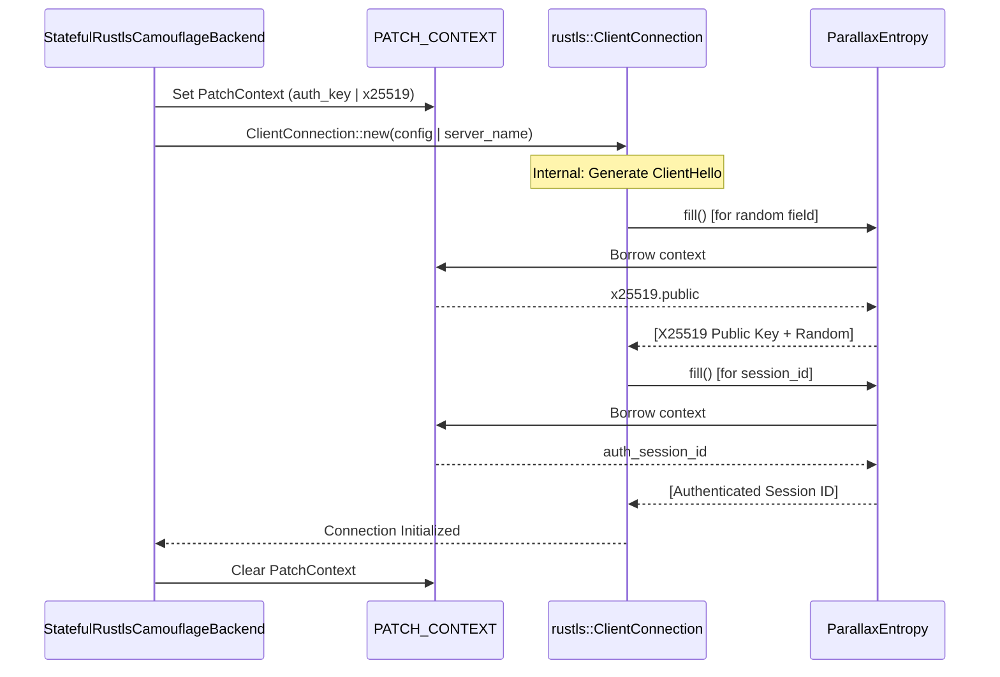

# Stateful Rustls Camouflage Backend
Relevant source files

- [src/tls/backend.rs](https://github.com/yuzeguitarist/ParallaX/blob/77045cea/src/tls/backend.rs)
- [src/tls/mod.rs](https://github.com/yuzeguitarist/ParallaX/blob/77045cea/src/tls/mod.rs)
- [src/tls/record.rs](https://github.com/yuzeguitarist/ParallaX/blob/77045cea/src/tls/record.rs)
- [src/tls/stateful.rs](https://github.com/yuzeguitarist/ParallaX/blob/77045cea/src/tls/stateful.rs)

The `StatefulRustlsCamouflageBackend` is a high-fidelity TLS camouflage implementation that leverages the `rustls` library to maintain a standard TLS 1.3 state machine while surgically injecting ParallaX authentication data. Unlike the `NativeCamouflageBackend` which uses a hand-written `ClientHello` builder, the stateful backend ensures perfect compliance with the `rustls` state machine, making it virtually indistinguishable from a standard Rust-based TLS client.

## Design Philosophy

The backend operates on a "minimal intervention" principle. It allows `rustls` to drive the handshake but intercepts entropy generation via a thread-local `PatchContext`. This allows the backend to:

1. Inject Authentication: Embed the ParallaX X25519 public key into the `ClientHello.random` field [src/tls/stateful.rs#5-6](https://github.com/yuzeguitarist/ParallaX/blob/77045cea/src/tls/stateful.rs#L5-L6)
2. Ensure Replay Protection: Inject an authenticated legacy `SessionID`[src/tls/stateful.rs#5-6](https://github.com/yuzeguitarist/ParallaX/blob/77045cea/src/tls/stateful.rs#L5-L6)
3. Disable Resumption: Force a full handshake by disabling TLS resumption, preventing PSK binders from invalidating ParallaX authentication tags [src/tls/stateful.rs#3-4](https://github.com/yuzeguitarist/ParallaX/blob/77045cea/src/tls/stateful.rs#L3-L4)

## Implementation Architecture

The core of the system is the `PATCH_CONTEXT` thread-local storage, which holds the necessary cryptographic material during the `rustls` configuration and connection initialization phase.

### Thread-Local Patching

The backend uses a `RefCell<Option<PatchContext>>` to store state during the narrow window where `rustls` generates the `ClientHello`[src/tls/stateful.rs#50-52](https://github.com/yuzeguitarist/ParallaX/blob/77045cea/src/tls/stateful.rs#L50-L52)

| Entity | Description |
| --- | --- |
| `PatchContext` | Stores `sni`, `auth_key`, and the `X25519KeyPair` used for the current handshake [src/tls/stateful.rs#55-61](https://github.com/yuzeguitarist/ParallaX/blob/77045cea/src/tls/stateful.rs#L55-L61) |
| `with_patch_context` | A wrapper that sets the thread-local context, executes a closure (usually `rustls` initialization), and clears the context [src/tls/stateful.rs#269-281](https://github.com/yuzeguitarist/ParallaX/blob/77045cea/src/tls/stateful.rs#L269-L281) |
| `ParallaxEntropy` | A custom `SecureRandom` implementation for `rustls` that pulls from `PATCH_CONTEXT` to overwrite random bytes with auth data [src/tls/stateful.rs#283-308](https://github.com/yuzeguitarist/ParallaX/blob/77045cea/src/tls/stateful.rs#L283-L308) |

### Entropy Interception Workflow

The following diagram illustrates how the `StatefulRustlsCamouflageBackend` intercepts `rustls` internal calls to inject ParallaX data.

Handshake Injection Flow

Sources: [src/tls/stateful.rs#160-180](https://github.com/yuzeguitarist/ParallaX/blob/77045cea/src/tls/stateful.rs#L160-L180)[src/tls/stateful.rs#283-308](https://github.com/yuzeguitarist/ParallaX/blob/77045cea/src/tls/stateful.rs#L283-L308)

## Handshake Execution and Post-Handshake Driving

Once the `ClientHello` is generated and verified, the `StatefulRustlsSession` takes over to drive the I/O loop. It doesn't just complete the TLS handshake; it also emulates post-handshake behavior typical of modern browsers.

### The Handshake Loop

The `complete` function [src/tls/stateful.rs#208-211](https://github.com/yuzeguitarist/ParallaX/blob/77045cea/src/tls/stateful.rs#L208-L211) manages the transition from TLS handshake to HTTP/2 initialization:

1. Handshake Driving: Reads TLS records from the `TcpStream` and feeds them to `rustls` via `read_tls` and `process_new_packets`[src/tls/stateful.rs#217-238](https://github.com/yuzeguitarist/ParallaX/blob/77045cea/src/tls/stateful.rs#L217-L238)
2. ServerHello Validation: Specifically looks for the TLS 1.3 `ServerHello` to ensure the target supports the expected protocol version [src/tls/stateful.rs#219-225](https://github.com/yuzeguitarist/ParallaX/blob/77045cea/src/tls/stateful.rs#L219-L225)
3. Record Tapping: Uses a `RecordEventTap` to track the number and size of records for fingerprinting purposes [src/tls/stateful.rs#88-90](https://github.com/yuzeguitarist/ParallaX/blob/77045cea/src/tls/stateful.rs#L88-L90)

### Post-Handshake Drain and HTTP/2 Preface

To mimic a browser effectively, the backend performs a "drain" phase after the TLS handshake completes. This involves:

- Draining Post-Handshake Records: Browsers often receive `NewSessionTicket` or other encrypted extensions immediately after the handshake. The backend drains up to `POST_HANDSHAKE_DRAIN_LIMIT` (4) records [src/tls/stateful.rs#43](https://github.com/yuzeguitarist/ParallaX/blob/77045cea/src/tls/stateful.rs#L43-L43)[src/tls/stateful.rs#242-243](https://github.com/yuzeguitarist/ParallaX/blob/77045cea/src/tls/stateful.rs#L242-L243)
- HTTP/2 Preface Exchange: If the ALPN negotiated is `h2`, the backend sends a browser-specific HTTP/2 connection preface and `SETTINGS` frames [src/tls/stateful.rs#250-257](https://github.com/yuzeguitarist/ParallaX/blob/77045cea/src/tls/stateful.rs#L250-L257)
- Settings ACK Handling: It waits for and acknowledges the server's HTTP/2 settings to complete the protocol transition [src/tls/stateful.rs#45-46](https://github.com/yuzeguitarist/ParallaX/blob/77045cea/src/tls/stateful.rs#L45-L46)

State Transition: Handshake to Data

Sources: [src/tls/stateful.rs#208-267](https://github.com/yuzeguitarist/ParallaX/blob/77045cea/src/tls/stateful.rs#L208-L267)[src/tls/stateful.rs#411-454](https://github.com/yuzeguitarist/ParallaX/blob/77045cea/src/tls/stateful.rs#L411-L454)

## Key Functions and Entities

### `StatefulRustlsCamouflageBackend::start`

Initializes the session by generating the `X25519KeyPair`, deriving the `auth_key`, and triggering the patched `rustls` configuration.

- Location: [src/tls/stateful.rs#160-195](https://github.com/yuzeguitarist/ParallaX/blob/77045cea/src/tls/stateful.rs#L160-L195)
- Validation: It performs a self-check on the generated `ClientHello` to ensure the authentication tags were correctly injected before proceeding [src/tls/stateful.rs#182-185](https://github.com/yuzeguitarist/ParallaX/blob/77045cea/src/tls/stateful.rs#L182-L185)

### `ProfileConfig`

Maps a `BrowserProfile` (e.g., Chrome 124, Safari 26) to specific TLS and HTTP/2 behaviors, including ALPN protocols and post-handshake record limits.

- Location: [src/tls/stateful.rs#114-122](https://github.com/yuzeguitarist/ParallaX/blob/77045cea/src/tls/stateful.rs#L114-L122)
- Defaults: Uses `POST_HANDSHAKE_DRAIN_LIMIT` (4) and `POST_HANDSHAKE_DRAIN_TIMEOUT` (180ms) to simulate natural network latency [src/tls/stateful.rs#135-142](https://github.com/yuzeguitarist/ParallaX/blob/77045cea/src/tls/stateful.rs#L135-L142)

### `ParallaxEntropy::fill`

The core interception point. It checks `PATCH_CONTEXT` to see if `session_id_pending` or `random_pending` is true. If so, it fills the requested buffer with the ParallaX-specific data instead of random bytes.

- Location: [src/tls/stateful.rs#291-307](https://github.com/yuzeguitarist/ParallaX/blob/77045cea/src/tls/stateful.rs#L291-L307)

## Data Flow: Record Processing

The backend handles raw TLS records using utilities from `src/tls/record.rs`.

| Function | Role |
| --- | --- |
| `read_record` | Asynchronously reads a complete TLS record (header + payload) from a `TcpStream`[src/tls/record.rs#76-96](https://github.com/yuzeguitarist/ParallaX/blob/77045cea/src/tls/record.rs#L76-L96) |
| `parse_header` | Extracts the content type and length from the 5-byte TLS header [src/tls/record.rs#29-45](https://github.com/yuzeguitarist/ParallaX/blob/77045cea/src/tls/record.rs#L29-L45) |
| `wrap_application_data` | Encapsulates ParallaX data into a standard TLS 1.3 Application Data record (0x17) [src/tls/record.rs#55-66](https://github.com/yuzeguitarist/ParallaX/blob/77045cea/src/tls/record.rs#L55-L66) |

Sources: [src/tls/stateful.rs](https://github.com/yuzeguitarist/ParallaX/blob/77045cea/src/tls/stateful.rs)[src/tls/record.rs](https://github.com/yuzeguitarist/ParallaX/blob/77045cea/src/tls/record.rs)[src/tls/backend.rs](https://github.com/yuzeguitarist/ParallaX/blob/77045cea/src/tls/backend.rs)