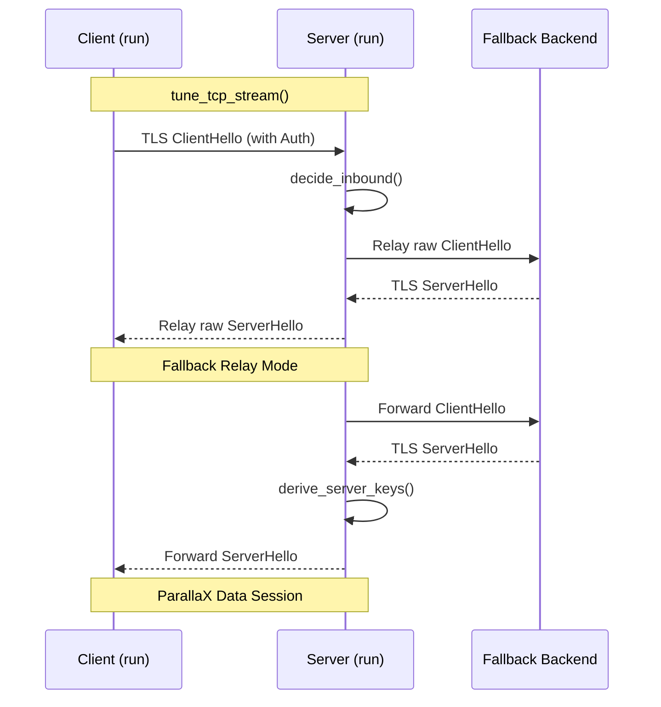

# TCP Camouflage Transport
Relevant source files

- [src/client/runtime.rs](https://github.com/yuzeguitarist/ParallaX/blob/77045cea/src/client/runtime.rs)
- [src/handshake/server.rs](https://github.com/yuzeguitarist/ParallaX/blob/77045cea/src/handshake/server.rs)
- [src/transport/tcp.rs](https://github.com/yuzeguitarist/ParallaX/blob/77045cea/src/transport/tcp.rs)

The TCP Camouflage Transport is the default transport mechanism for ParallaX, designed to wrap protocol data within a stream that mimics standard TLS 1.3 traffic. It leverages raw TCP connections to perform a camouflage handshake against a legitimate backend (the "fallback") before transitioning into an encrypted, padded data relay.

## Stream Optimization

Before any data is exchanged, ParallaX tunes the underlying `TcpStream` to ensure low latency and high performance. This is handled by the `tune_tcp_stream` function [src/transport/tcp.rs#5-9](https://github.com/yuzeguitarist/ParallaX/blob/77045cea/src/transport/tcp.rs#L5-L9)

Key optimizations include:

- TCP_NODELAY: Set to `true` to disable Nagle's algorithm, ensuring small protocol control messages (like PQ rekeying) are sent immediately [src/transport/tcp.rs#6](https://github.com/yuzeguitarist/ParallaX/blob/77045cea/src/transport/tcp.rs#L6-L6)
- BBR Congestion Control: On Linux systems, the transport attempts to set the congestion control algorithm to `bbr` via `setsockopt`[src/transport/tcp.rs#12-49](https://github.com/yuzeguitarist/ParallaX/blob/77045cea/src/transport/tcp.rs#L12-L49) If BBR is unavailable, it falls back to the kernel default [src/transport/tcp.rs#46-48](https://github.com/yuzeguitarist/ParallaX/blob/77045cea/src/transport/tcp.rs#L46-L48)

Sources:[src/transport/tcp.rs#1-53](https://github.com/yuzeguitarist/ParallaX/blob/77045cea/src/transport/tcp.rs#L1-L53)

## TCP Transport Data Flow

The lifecycle of a TCP transport session involves transitioning from a raw socket to a camouflaged TLS handshake, and finally to a split-stream data relay.

### Connection Establishment Sequence

The following diagram illustrates how the `ClientRuntime` and `HandshakeServer` utilize TCP streams to establish a session.

TCP Transport Lifecycle

Sources:[src/client/runtime.rs#108-156](https://github.com/yuzeguitarist/ParallaX/blob/77045cea/src/client/runtime.rs#L108-L156)[src/handshake/server.rs#202-232](https://github.com/yuzeguitarist/ParallaX/blob/77045cea/src/handshake/server.rs#L202-L232)[src/transport/tcp.rs#5-9](https://github.com/yuzeguitarist/ParallaX/blob/77045cea/src/transport/tcp.rs#L5-L9)

## Record-Layer Framing

Once the camouflage handshake is complete, all data is encapsulated in TLS-like records. The transport does not send raw application data; instead, it uses a record-layer framing that mimics TLS 1.3 protected records.

### Framing Implementation

- Reading Records: The function `read_record` is used by both client and server to pull the next framed message from the TCP stream [src/client/runtime.rs#128](https://github.com/yuzeguitarist/ParallaX/blob/77045cea/src/client/runtime.rs#L128-L128)[src/handshake/server.rs#242](https://github.com/yuzeguitarist/ParallaX/blob/77045cea/src/handshake/server.rs#L242-L242)
- Writing Records: Encrypted records (seals) are written directly to the `TcpStream` using `write_all`[src/client/runtime.rs#127](https://github.com/yuzeguitarist/ParallaX/blob/77045cea/src/client/runtime.rs#L127-L127)
- Initial Payload Capture: To reduce latency, the client attempts to capture the first few bytes of the local SOCKS5 connection (the `initial_payload`) and bundle them into the first encrypted `ConnectRequest` record [src/client/runtime.rs#118-142](https://github.com/yuzeguitarist/ParallaX/blob/77045cea/src/client/runtime.rs#L118-L142)

Sources:[src/client/runtime.rs#158-176](https://github.com/yuzeguitarist/ParallaX/blob/77045cea/src/client/runtime.rs#L158-L176)[src/handshake/server.rs#43-50](https://github.com/yuzeguitarist/ParallaX/blob/77045cea/src/handshake/server.rs#L43-L50)

## Split Read/Write Relay Model

After the handshake and command phase (PQ rekey and identity proof), the transport enters the `relay` loop. ParallaX utilizes Tokio's `into_split()` to divide the `TcpStream` into `OwnedReadHalf` and `OwnedWriteHalf`[src/client/runtime.rs#144-145](https://github.com/yuzeguitarist/ParallaX/blob/77045cea/src/client/runtime.rs#L144-L145)

### The Relay Loop

The relay mechanism operates two concurrent tasks using `tokio::select!`:

1. Local to Server: Reads raw data from the local SOCKS5 socket, encrypts it via `ClientDataSession::seal_payload`, and writes the resulting TLS record to the server's TCP write half [src/client/runtime.rs#218-223](https://github.com/yuzeguitarist/ParallaX/blob/77045cea/src/client/runtime.rs#L218-L223)
2. Server to Local: Reads TLS records from the server's TCP read half, decrypts them, and writes the plaintext to the local SOCKS5 socket [src/client/runtime.rs#232-237](https://github.com/yuzeguitarist/ParallaX/blob/77045cea/src/client/runtime.rs#L232-L237)

### Entity Mapping: Transport Components

This diagram maps the natural language concepts of the transport to the specific code entities implementing them.

Code Entity Map: TCP Transport

[Flowchart Diagram]

Sources:[src/client/runtime.rs#198-240](https://github.com/yuzeguitarist/ParallaX/blob/77045cea/src/client/runtime.rs#L198-L240)[src/transport/tcp.rs#5-12](https://github.com/yuzeguitarist/ParallaX/blob/77045cea/src/transport/tcp.rs#L5-L12)[src/protocol/data.rs#38-42](https://github.com/yuzeguitarist/ParallaX/blob/77045cea/src/protocol/data.rs#L38-L42)

## Summary of Key Functions

| Function | File | Purpose |
| --- | --- | --- |
| `tune_tcp_stream` | `src/transport/tcp.rs` | Applies `TCP_NODELAY` and BBR congestion control to the socket. |
| `read_record` | `src/tls/record.rs` | Reads a framed TLS record from the TCP stream. |
| `relay` | `src/client/runtime.rs` | The main loop handling bidirectional data transfer between local and remote TCP halves. |
| `handle_local_connection` | `src/client/runtime.rs` | Orchestrates the transition from SOCKS5 request to camouflaged TCP relay. |
| `relay_fallback` | `src/handshake/server.rs` | Transparently pipes TCP traffic to the fallback backend when authentication fails. |

Sources:[src/client/runtime.rs#108-156](https://github.com/yuzeguitarist/ParallaX/blob/77045cea/src/client/runtime.rs#L108-L156)[src/client/runtime.rs#198-240](https://github.com/yuzeguitarist/ParallaX/blob/77045cea/src/client/runtime.rs#L198-L240)[src/handshake/server.rs#204-207](https://github.com/yuzeguitarist/ParallaX/blob/77045cea/src/handshake/server.rs#L204-L207)[src/transport/tcp.rs#5-9](https://github.com/yuzeguitarist/ParallaX/blob/77045cea/src/transport/tcp.rs#L5-L9)