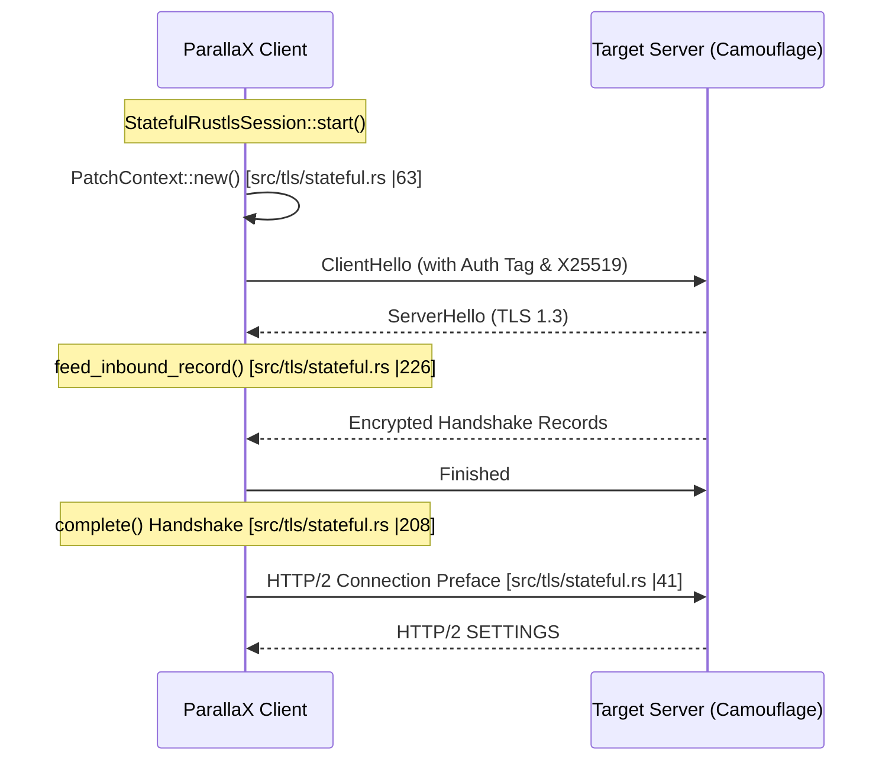

# TLS Camouflage Layer
Relevant source files

- [src/tls/backend.rs](https://github.com/yuzeguitarist/ParallaX/blob/77045cea/src/tls/backend.rs)
- [src/tls/client_hello_builder.rs](https://github.com/yuzeguitarist/ParallaX/blob/77045cea/src/tls/client_hello_builder.rs)
- [src/tls/mod.rs](https://github.com/yuzeguitarist/ParallaX/blob/77045cea/src/tls/mod.rs)
- [src/tls/stateful.rs](https://github.com/yuzeguitarist/ParallaX/blob/77045cea/src/tls/stateful.rs)

The TLS Camouflage Layer is responsible for making ParallaX traffic indistinguishable from legitimate web browser activity. Unlike traditional proxies that use identifiable TLS fingerprints, ParallaX actively mimics specific browser behaviors during and after the TLS handshake. This layer handles the construction of authentic `ClientHello` messages, manages a stateful TLS stack that supports authentication hijacking, and simulates application-layer HTTP/2 fingerprints.

## System Architecture

The camouflage system operates across three primary stages: initial packet construction, the live handshake state machine, and post-handshake protocol emulation.

### Camouflage Flow Overview

| Stage | Entity | Responsibility |
| --- | --- | --- |
| Construction | `ClientHelloTemplate` | Generates a byte-perfect `ClientHello` matching a `BrowserProfile`. |
| Handshake | `StatefulRustlsCamouflageBackend` | Drives a real TLS 1.3 handshake while injecting ParallaX auth tags. |
| Emulation | `Http2Fingerprint` | Sends browser-specific H2 settings and frames to mimic web traffic. |

### Component Interaction Diagram

This diagram illustrates how high-level browser profiles are translated into specific code entities and data structures.

[Flowchart Diagram]

Sources:[src/tls/client_hello_builder.rs#27-33](https://github.com/yuzeguitarist/ParallaX/blob/77045cea/src/tls/client_hello_builder.rs#L27-L33)[src/tls/stateful.rs#50-61](https://github.com/yuzeguitarist/ParallaX/blob/77045cea/src/tls/stateful.rs#L50-L61)[src/tls/stateful.rs#156-196](https://github.com/yuzeguitarist/ParallaX/blob/77045cea/src/tls/stateful.rs#L156-L196)

---

## 4.1 ClientHello Builder & Browser Profiles

ParallaX provides a hand-written `ClientHello` construction engine used for high-fidelity mimicry. This component ensures that extension ordering, GREASE values, and cipher suites perfectly match the target browser.

- Browser Profiles: Supports `Safari17` and `Chrome124`[src/tls/client_hello_builder.rs#27-33](https://github.com/yuzeguitarist/ParallaX/blob/77045cea/src/tls/client_hello_builder.rs#L27-L33)
- Authentication Hijacking: ParallaX hijacks the TLS `random` field to carry the client's X25519 public key [src/tls/client_hello_builder.rs#80-81](https://github.com/yuzeguitarist/ParallaX/blob/77045cea/src/tls/client_hello_builder.rs#L80-L81) and the `legacy_session_id` to carry an authentication tag [src/tls/client_hello_builder.rs#61-62](https://github.com/yuzeguitarist/ParallaX/blob/77045cea/src/tls/client_hello_builder.rs#L61-L62)
- GREASE Injection: Implements RFC 8701 to inject "Generate Random Extensions And Sustain Extensibility" values into cipher suites and extensions [src/tls/client_hello_builder.rs#85-89](https://github.com/yuzeguitarist/ParallaX/blob/77045cea/src/tls/client_hello_builder.rs#L85-L89)

For details on extension ordering and the `NativeCamouflageBackend`, see [ClientHello Builder & Browser Profiles](#4.1).

Sources:[src/tls/client_hello_builder.rs#46-50](https://github.com/yuzeguitarist/ParallaX/blob/77045cea/src/tls/client_hello_builder.rs#L46-L50)[src/tls/client_hello_builder.rs#123-146](https://github.com/yuzeguitarist/ParallaX/blob/77045cea/src/tls/client_hello_builder.rs#L123-L146)[src/tls/backend.rs#52-67](https://github.com/yuzeguitarist/ParallaX/blob/77045cea/src/tls/backend.rs#L52-L67)

---

## 4.2 Stateful Rustls Camouflage Backend

While the builder creates static packets, the `StatefulRustlsCamouflageBackend` manages the dynamic handshake. It uses `rustls` as the underlying state machine but intercepts its internal operations to inject ParallaX-specific data.

- PatchContext: A thread-local storage mechanism that allows the backend to override `rustls` entropy generation [src/tls/stateful.rs#50-73](https://github.com/yuzeguitarist/ParallaX/blob/77045cea/src/tls/stateful.rs#L50-L73) This ensures that even when `rustls` generates a "random" `ClientHello`, it actually contains the ParallaX X25519 key and authentication tag.
- Handshake Driving: The backend handles reading/writing TLS records and ensures the server responds with a valid TLS 1.3 `ServerHello`[src/tls/stateful.rs#217-226](https://github.com/yuzeguitarist/ParallaX/blob/77045cea/src/tls/stateful.rs#L217-L226)
- Post-Handshake Drain: To avoid timing attacks, the backend "drains" post-handshake records (like NewSessionTicket) before handing off the connection [src/tls/stateful.rs#43-44](https://github.com/yuzeguitarist/ParallaX/blob/77045cea/src/tls/stateful.rs#L43-L44)

For details on the entropy interception and handshake synchronization, see [Stateful Rustls Camouflage Backend](#4.2).

Sources:[src/tls/stateful.rs#156-172](https://github.com/yuzeguitarist/ParallaX/blob/77045cea/src/tls/stateful.rs#L156-L172)[src/tls/stateful.rs#208-230](https://github.com/yuzeguitarist/ParallaX/blob/77045cea/src/tls/stateful.rs#L208-L230)

---

## 4.3 HTTP/2 Fingerprinting

Handshaking as a browser is insufficient if the subsequent application traffic is immediate and uniform. ParallaX emulates the HTTP/2 "preface" and initial settings exchange that occurs immediately after TLS.

- Peer Profiles: Maps `BrowserProfile` to specific `Http2PeerProfile` settings (e.g., Safari vs. Chrome initial windows) [src/tls/stateful.rs#131-134](https://github.com/yuzeguitarist/ParallaX/blob/77045cea/src/tls/stateful.rs#L131-L134)
- Frame Emulation: Constructs valid HTTP/2 `SETTINGS`, `WINDOW_UPDATE`, and `HEADERS` frames [src/tls/stateful.rs#41-48](https://github.com/yuzeguitarist/ParallaX/blob/77045cea/src/tls/stateful.rs#L41-L48)
- Protocol Transition: Once the H2 handshake is emulated, the connection transitions to the ParallaX data relay mode.

For details on HPACK encoding and browser-specific frame sequences, see [HTTP/2 Fingerprinting](#4.3).

Sources:[src/tls/stateful.rs#114-122](https://github.com/yuzeguitarist/ParallaX/blob/77045cea/src/tls/stateful.rs#L114-L122)[src/tls/stateful.rs#124-144](https://github.com/yuzeguitarist/ParallaX/blob/77045cea/src/tls/stateful.rs#L124-L144)

---

## Technical Mapping

The following diagram maps the internal logic of the `StatefulRustlsSession` to the network events it generates.

Sources:[src/tls/stateful.rs#208-230](https://github.com/yuzeguitarist/ParallaX/blob/77045cea/src/tls/stateful.rs#L208-L230)[src/tls/stateful.rs#41-48](https://github.com/yuzeguitarist/ParallaX/blob/77045cea/src/tls/stateful.rs#L41-L48)