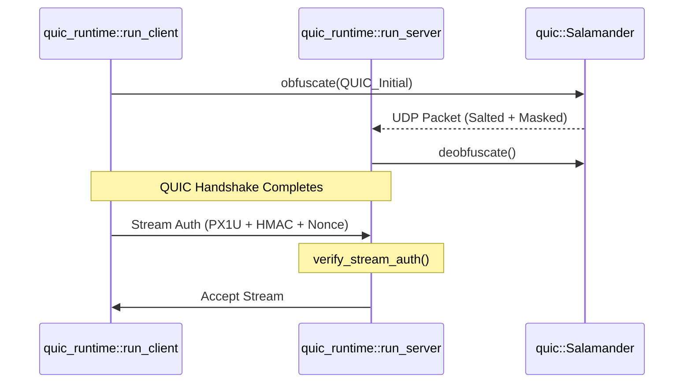

# Transport Layer
Relevant source files

- [src/transport/mod.rs](https://github.com/yuzeguitarist/ParallaX/blob/77045cea/src/transport/mod.rs)
- [src/transport/quic.rs](https://github.com/yuzeguitarist/ParallaX/blob/77045cea/src/transport/quic.rs)
- [src/transport/quic_runtime.rs](https://github.com/yuzeguitarist/ParallaX/blob/77045cea/src/transport/quic_runtime.rs)
- [src/transport/tcp.rs](https://github.com/yuzeguitarist/ParallaX/blob/77045cea/src/transport/tcp.rs)

The Transport Layer in ParallaX is responsible for the reliable delivery of protocol data between the client and server. It abstracts the underlying network protocols—TCP and UDP—into a unified relay interface while applying specific optimizations for latency and censorship resistance.

ParallaX supports two primary transport modes:

1. TCP Camouflage Transport: The default mode, which tunnels encrypted data through a legitimate-looking TLS 1.3 handshake to a camouflage target.
2. QUIC/UDP Transport: A high-performance alternative using the QUIC protocol, featuring per-stream HMAC authentication and packet obfuscation via the `Salamander` module.

### Transport System Overview

The following diagram illustrates how the transport layer connects high-level runtimes to the network socket layer.

Diagram: Transport Layer Architecture

Sources: [src/transport/mod.rs#1-4](https://github.com/yuzeguitarist/ParallaX/blob/77045cea/src/transport/mod.rs#L1-L4)[src/transport/tcp.rs#5-9](https://github.com/yuzeguitarist/ParallaX/blob/77045cea/src/transport/tcp.rs#L5-L9)[src/transport/quic_runtime.rs#106-165](https://github.com/yuzeguitarist/ParallaX/blob/77045cea/src/transport/quic_runtime.rs#L106-L165)

---

## TCP Camouflage Transport

The TCP transport is the backbone of ParallaX's camouflage mechanism. It utilizes standard `Tokio` TCP streams but applies kernel-level optimizations to ensure low latency and high throughput, particularly on Linux systems where it attempts to enable the BBR (Bottleneck Bandwidth and Round-trip propagation time) congestion control algorithm.

### Key Features

- Socket Tuning: The `tune_tcp_stream` function sets `TCP_NODELAY` to disable Nagle's algorithm and attempts to set the `TCP_CONGESTION` socket option to `bbr`[src/transport/tcp.rs#5-49](https://github.com/yuzeguitarist/ParallaX/blob/77045cea/src/transport/tcp.rs#L5-L49)
- TLS Integration: This layer carries the camouflage TLS handshake, making the connection indistinguishable from standard HTTPS traffic to a passive observer.

For technical details on framing and relaying over TCP, see [TCP Camouflage Transport](#6.1).

Sources:[src/transport/tcp.rs#1-53](https://github.com/yuzeguitarist/ParallaX/blob/77045cea/src/transport/tcp.rs#L1-L53)

---

## QUIC Transport (Salamander)

The QUIC transport provides a modern, multiplexed alternative to TCP. It is implemented using the `quinn` library and adds several ParallaX-specific security layers to prevent active probing and protocol identification.

### Protocol Stack & Security

Unlike standard QUIC, ParallaX's implementation includes:

- Salamander Obfuscation: A BLAKE2b-based packet obfuscator that XOR-masks QUIC packets with a key-derived stream, preventing protocol fingerprinting at the UDP level [src/transport/quic.rs#22-75](https://github.com/yuzeguitarist/ParallaX/blob/77045cea/src/transport/quic.rs#L22-L75)
- Per-Stream Authentication: Every QUIC stream begins with a mandatory authentication frame (`QUIC_AUTH_MAGIC` = `PX1U`) containing an HMAC-SHA256 tag and a timestamp to prevent unauthorized usage and replay attacks [src/transport/quic_runtime.rs#32-40](https://github.com/yuzeguitarist/ParallaX/blob/77045cea/src/transport/quic_runtime.rs#L32-L40)
- Congestion Control: Uses a "brutal-like" initial window of 96 packets to accelerate the start of data transmission [src/transport/quic_runtime.rs#41](https://github.com/yuzeguitarist/ParallaX/blob/77045cea/src/transport/quic_runtime.rs#L41-L41)

Diagram: QUIC Stream Establishment & Auth

Sources: [src/transport/quic_runtime.rs#33-37](https://github.com/yuzeguitarist/ParallaX/blob/77045cea/src/transport/quic_runtime.rs#L33-L37)[src/transport/quic_runtime.rs#191-210](https://github.com/yuzeguitarist/ParallaX/blob/77045cea/src/transport/quic_runtime.rs#L191-L210)[src/transport/quic.rs#33-63](https://github.com/yuzeguitarist/ParallaX/blob/77045cea/src/transport/quic.rs#L33-L63)

### Operational Modes

- Server: The `run_server` function initializes a QUIC `Endpoint` and manages a `ReplayCache` to track unique nonces from stream authentication frames [src/transport/quic_runtime.rs#106-134](https://github.com/yuzeguitarist/ParallaX/blob/77045cea/src/transport/quic_runtime.rs#L106-L134)
- Client: The `run_client` function provides a SOCKS5 interface that maps local TCP connections to remote QUIC streams [src/transport/quic_runtime.rs#136-165](https://github.com/yuzeguitarist/ParallaX/blob/77045cea/src/transport/quic_runtime.rs#L136-L165)

For details on BBR configuration, flow control, and 0-RTT resumption, see [QUIC Transport (quic_runtime & Salamander)](#6.2).

Sources:[src/transport/quic_runtime.rs#1-210](https://github.com/yuzeguitarist/ParallaX/blob/77045cea/src/transport/quic_runtime.rs#L1-L210)[src/transport/quic.rs#1-127](https://github.com/yuzeguitarist/ParallaX/blob/77045cea/src/transport/quic.rs#L1-L127)